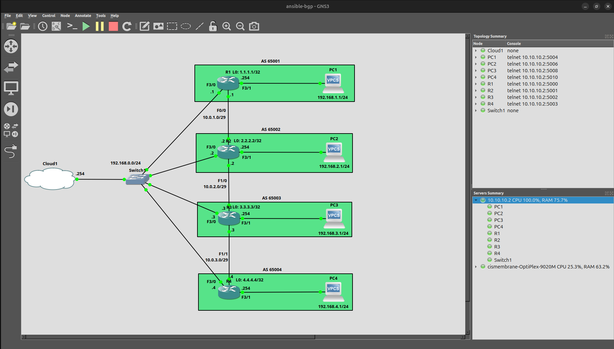

# BGP Deployment with Ansible

Four Cisco c7200 routers in a linear BGP chain, one AS per router. Ansible pushes interface addressing and BGP config through Jinja2 templates. A separate verification playbook checks neighbor state and pings across the full path. Built in GNS3.

## Topology

R1 through R4 in sequence. Each router sits in its own autonomous system.

```
     [R1]----------[R2]----------[R3]----------[R4]
    AS 65001      AS 65002      AS 65003      AS 65004

  R1 Fa0/0  10.0.1.1 ----[ 10.0.1.0/29 ]---- 10.0.1.2  Fa0/0  R2
  R2 Fa1/0  10.0.2.2 ----[ 10.0.2.0/29 ]---- 10.0.2.3  Fa1/0  R3
  R3 Fa1/1  10.0.3.3 ----[ 10.0.3.0/29 ]---- 10.0.3.4  Fa1/1  R4
```

Every router has a Loopback0 used as its BGP router-id (X.X.X.X/32, matching the router number), a management interface on FastEthernet3/0 (192.168.0.0/24), and a LAN segment on FastEthernet3/1 (192.168.X.0/24). Each router advertises its loopback and LAN prefix into BGP.

| Router | Interface | Address          | Description     |
|--------|-----------|------------------|-----------------|
| R1     | Loopback0 | 1.1.1.1/32       | Router_ID       |
| R1     | Fa0/0     | 10.0.1.1/29      | To_R2           |
| R1     | Fa3/0     | 192.168.0.1/24   | Management      |
| R1     | Fa3/1     | 192.168.1.254/24 | LAN_192.168.1.0 |
| R2     | Loopback0 | 2.2.2.2/32       | Router_ID       |
| R2     | Fa0/0     | 10.0.1.2/29      | To_R1           |
| R2     | Fa1/0     | 10.0.2.2/29      | To_R3           |
| R2     | Fa3/0     | 192.168.0.2/24   | Management      |
| R2     | Fa3/1     | 192.168.2.254/24 | LAN_192.168.2.0 |
| R3     | Loopback0 | 3.3.3.3/32       | Router_ID       |
| R3     | Fa1/0     | 10.0.2.3/29      | To_R2           |
| R3     | Fa1/1     | 10.0.3.3/29      | To_R4           |
| R3     | Fa3/0     | 192.168.0.3/24   | Management      |
| R3     | Fa3/1     | 192.168.3.254/24 | LAN_192.168.3.0 |
| R4     | Loopback0 | 4.4.4.4/32       | Router_ID       |
| R4     | Fa1/1     | 10.0.3.4/29      | To_R3           |
| R4     | Fa3/0     | 192.168.0.4/24   | Management      |
| R4     | Fa3/1     | 192.168.4.254/24 | LAN_192.168.4.0 |



## Project Structure

```
ansible-bgp/
├── .gitignore
├── ansible.cfg
├── ansible-bgp.gns3
├── inventory.yml
├── deploy.yml
├── verify.yml
├── configs/
│   ├── R1-config.txt
│   ├── R2-config.txt
│   ├── R3-config.txt
│   └── R4-config.txt
├── group_vars/
│   └── routers.yml
├── host_vars/
│   ├── R1.yml
│   ├── R2.yml
│   ├── R3.yml
│   └── R4.yml
├── images/
│   ├── gns3-topology.png
│   ├── deploy-output.png
│   ├── verify-output-1.png
│   └── verify-output-2.png
└── templates/
    ├── interfaces.j2
    └── bgp.j2
```

The `configs/` directory holds post-deployment running configs captured from each router.

## How It Works

The inventory puts R1 through R4 under a single `routers` group, each reachable on its management IP (192.168.0.1 through .4). Connection parameters in `group_vars/routers.yml` set `cisco.ios.ios` as the network OS and `network_cli` as the connection plugin, with enable mode credentials.

Each router's host_vars file defines its hostname, router-id, ASN, interfaces, BGP neighbors, and network statements. The `interfaces.j2` template configures the hostname, interface descriptions, IP addressing, and `no shutdown` on every listed interface. The `bgp.j2` template configures the full BGP process: router-id, neighbor statements with remote-as and descriptions, and the IPv4 unicast address-family with network and neighbor activate statements.

`deploy.yml` runs two tasks against all routers. First task pushes the interfaces template, second pushes the BGP template. Both use `cisco.ios.ios_config` with the `src` parameter pointing at the Jinja2 file.

`verify.yml` collects `show ip bgp summary` and `show ip bgp` from every router and prints the output. Two assert tasks check that no neighbor is stuck in Idle or Active state. On R1 and R4, it pings the opposite end's LAN gateway (R1 pings 192.168.4.254, R4 pings 192.168.1.254) sourced from the local router-id to confirm end-to-end reachability across the full BGP path.

## Running the Lab

1. Start the GNS3 topology. Confirm all four routers respond on their management IPs.
2. Deploy:
   ```
   ansible-playbook deploy.yml
   ```
3. Verify:
   ```
   ansible-playbook verify.yml
   ```

## Prerequisites

Ansible with the `cisco.ios` and `ansible.netcommon` collections installed. GNS3 running c7200 images (IOS 15.3) with management connectivity to the Ansible control node over 192.168.0.0/24.

### Router Bootstrap (before first playbook run)

Ansible connects over SSH, so each router needs SSH enabled manually before the playbooks can reach it. On each router, configure the following (swap the hostname per device):

```
conf t
hostname R1
ip domain-name lab
crypto key generate rsa modulus 1024
username admin privilege 15 secret admin
enable secret admin
line vty 0 15
 login local
 transport input ssh
interface FastEthernet3/0
 ip address 192.168.0.1 255.255.255.0
 no shutdown
end
```

The hostname and domain name are both required before IOS will generate RSA keys. The credentials here match what `group_vars/routers.yml` expects. Swap the hostname and management IP per router (192.168.0.1 through .4).

### SSH Cipher Compatibility

The c7200 on IOS 15.3 only offers CBC-mode ciphers and legacy key exchange algorithms. Modern OpenSSH clients reject these by default. Add the following to `~/.ssh/config` on the Ansible control node:

```
Host 192.168.0.*
    KexAlgorithms +diffie-hellman-group14-sha1
    HostKeyAlgorithms +ssh-rsa
    PubkeyAcceptedAlgorithms +ssh-rsa
    Ciphers +aes128-cbc,aes256-cbc,3des-cbc
    User admin
```

Alternatively, set it in `group_vars/routers.yml` so the workaround travels with the project instead of depending on local SSH config:

```yaml
ansible_ssh_common_args: >-
  -o KexAlgorithms=+diffie-hellman-group14-sha1
  -o HostKeyAlgorithms=+ssh-rsa
  -o PubkeyAcceptedAlgorithms=+ssh-rsa
  -o Ciphers=+aes128-cbc,aes256-cbc,3des-cbc
```

Verify SSH works interactively (`ssh admin@192.168.0.1`) before running Ansible. If the connection works manually, Ansible will work.

## Verification

### deploy.yml

Successful run pushing interface and BGP configuration to all four routers. Both tasks return `changed` on every host, and the recap shows `changed=2` with zero failures.

<details>
<summary>deploy.yml output</summary>

```
PLAY [Deploy BGP configuration] *********************************************************************

TASK [Configure hostname and interfaces] ************************************************************
changed: [R1]
changed: [R4]
changed: [R2]
changed: [R3]

TASK [Configure BGP] ********************************************************************************
changed: [R1]
changed: [R4]
changed: [R2]
changed: [R3]

PLAY RECAP ******************************************************************************************
R1                         : ok=2    changed=2    unreachable=0    failed=0    skipped=0    rescued=0    ignored=0
R2                         : ok=2    changed=2    unreachable=0    failed=0    skipped=0    rescued=0    ignored=0
R3                         : ok=2    changed=2    unreachable=0    failed=0    skipped=0    rescued=0    ignored=0
R4                         : ok=2    changed=2    unreachable=0    failed=0    skipped=0    rescued=0    ignored=0
```
</details>

### verify.yml

The verify playbook collects `show ip bgp summary` and `show ip bgp` from all four routers, asserts no neighbors are stuck in Idle or Active state, and runs end-to-end pings between R1 and R4.

<details>
<summary>BGP summary per router</summary>

```
TASK [Display BGP summary] **************************************************************************
ok: [R1] =>
  BGP router identifier 1.1.1.1, local AS number 65001
  BGP table version is 9, 8 network entries using 1152 bytes of memory
  Neighbor        V           AS MsgRcvd MsgSent   TblVer  InQ OutQ Up/Down  State/PfxRcd
  10.0.1.2        4        65002      33      30        9    0    0 00:23:49        6

ok: [R2] =>
  BGP router identifier 2.2.2.2, local AS number 65002
  BGP table version is 9, 8 network entries using 1152 bytes of memory
  Neighbor        V           AS MsgRcvd MsgSent   TblVer  InQ OutQ Up/Down  State/PfxRcd
  10.0.1.1        4        65001      30      33        9    0    0 00:23:49        2
  10.0.2.3        4        65003      32      32        9    0    0 00:23:50        4

ok: [R3] =>
  BGP router identifier 3.3.3.3, local AS number 65003
  BGP table version is 9, 8 network entries using 1152 bytes of memory
  Neighbor        V           AS MsgRcvd MsgSent   TblVer  InQ OutQ Up/Down  State/PfxRcd
  10.0.2.2        4        65002      32      32        9    0    0 00:23:50        4
  10.0.3.4        4        65004      30      32        9    0    0 00:23:51        2

ok: [R4] =>
  BGP router identifier 4.4.4.4, local AS number 65004
  BGP table version is 9, 8 network entries using 1152 bytes of memory
  Neighbor        V           AS MsgRcvd MsgSent   TblVer  InQ OutQ Up/Down  State/PfxRcd
  10.0.3.3        4        65003      32      30        9    0    0 00:23:52        6
```
</details>

<details>
<summary>BGP table per router</summary>

```
TASK [Display BGP table] ****************************************************************************
ok: [R1] =>
  BGP table version is 9, local router ID is 1.1.1.1
     Network          Next Hop            Metric LocPrf Weight Path
  *> 1.1.1.1/32       0.0.0.0                  0         32768 i
  *> 2.2.2.2/32       10.0.1.2                 0             0 65002 i
  *> 3.3.3.3/32       10.0.1.2                               0 65002 65003 i
  *> 4.4.4.4/32       10.0.1.2                               0 65002 65003 65004 i
  *> 192.168.1.0      0.0.0.0                  0         32768 i
  *> 192.168.2.0      10.0.1.2                 0             0 65002 i
  *> 192.168.3.0      10.0.1.2                               0 65002 65003 i
  *> 192.168.4.0      10.0.1.2                               0 65002 65003 65004 i

ok: [R2] =>
  BGP table version is 9, local router ID is 2.2.2.2
     Network          Next Hop            Metric LocPrf Weight Path
  *> 1.1.1.1/32       10.0.1.1                 0             0 65001 i
  *> 2.2.2.2/32       0.0.0.0                  0         32768 i
  *> 3.3.3.3/32       10.0.2.3                 0             0 65003 i
  *> 4.4.4.4/32       10.0.2.3                               0 65003 65004 i
  *> 192.168.1.0      10.0.1.1                 0             0 65001 i
  *> 192.168.2.0      0.0.0.0                  0         32768 i
  *> 192.168.3.0      10.0.2.3                 0             0 65003 i
  *> 192.168.4.0      10.0.2.3                               0 65003 65004 i

ok: [R3] =>
  BGP table version is 9, local router ID is 3.3.3.3
     Network          Next Hop            Metric LocPrf Weight Path
  *> 1.1.1.1/32       10.0.2.2                               0 65002 65001 i
  *> 2.2.2.2/32       10.0.2.2                 0             0 65002 i
  *> 3.3.3.3/32       0.0.0.0                  0         32768 i
  *> 4.4.4.4/32       10.0.3.4                 0             0 65004 i
  *> 192.168.1.0      10.0.2.2                               0 65002 65001 i
  *> 192.168.2.0      10.0.2.2                 0             0 65002 i
  *> 192.168.3.0      0.0.0.0                  0         32768 i
  *> 192.168.4.0      10.0.3.4                 0             0 65004 i

ok: [R4] =>
  BGP table version is 9, local router ID is 4.4.4.4
     Network          Next Hop            Metric LocPrf Weight Path
  *> 1.1.1.1/32       10.0.3.3                               0 65003 65002 65001 i
  *> 2.2.2.2/32       10.0.3.3                               0 65003 65002 i
  *> 3.3.3.3/32       10.0.3.3                 0             0 65003 i
  *> 4.4.4.4/32       0.0.0.0                  0         32768 i
  *> 192.168.1.0      10.0.3.3                               0 65003 65002 65001 i
  *> 192.168.2.0      10.0.3.3                               0 65003 65002 i
  *> 192.168.3.0      10.0.3.3                 0             0 65003 i
  *> 192.168.4.0      0.0.0.0                  0         32768 i
```
</details>

<details>
<summary>Neighbor state assertions and ping results</summary>

```
TASK [Verify no neighbors in Idle state] ************************************************************
ok: [R1] => "No Idle neighbors on R1"
ok: [R2] => "No Idle neighbors on R2"
ok: [R3] => "No Idle neighbors on R3"
ok: [R4] => "No Idle neighbors on R4"

TASK [Verify no neighbors in Active state] **********************************************************
ok: [R1] => "No stuck neighbors on R1"
ok: [R2] => "No stuck neighbors on R2"
ok: [R3] => "No stuck neighbors on R3"
ok: [R4] => "No stuck neighbors on R4"

TASK [Display ping results] *************************************************************************
ok: [R1] =>
  Sending 5, 100-byte ICMP Echos to 192.168.4.254, timeout is 2 seconds:
  Packet sent with a source address of 1.1.1.1
  !!!!!
  Success rate is 100 percent (5/5), round-trip min/avg/max = 32/43/52 ms

ok: [R4] =>
  Sending 5, 100-byte ICMP Echos to 192.168.1.254, timeout is 2 seconds:
  Packet sent with a source address of 4.4.4.4
  !!!!!
  Success rate is 100 percent (5/5), round-trip min/avg/max = 28/36/52 ms

PLAY RECAP ******************************************************************************************
R1                         : ok=8    changed=0    unreachable=0    failed=0    skipped=0    rescued=0    ignored=0
R2                         : ok=7    changed=0    unreachable=0    failed=0    skipped=1    rescued=0    ignored=0
R3                         : ok=7    changed=0    unreachable=0    failed=0    skipped=1    rescued=0    ignored=0
R4                         : ok=8    changed=0    unreachable=0    failed=0    skipped=0    rescued=0    ignored=0
```
</details>

All four routers have converged on the full set of eight prefixes. R1 and R4 sit at opposite ends of the AS chain, so their BGP tables show the longest AS_PATH entries (three hops for the far-end prefixes). The endpoint PfxRcd counts confirm the expected distribution: R1 and R4 each receive 6 prefixes from their single neighbor, while R2 and R3 each receive 2 from one side and 4 from the other. End-to-end pings between R1 (sourced from 1.1.1.1) and R4's LAN gateway (192.168.4.254), and vice versa, succeed at 100%.

## Notes

The `bgp.j2` template renders network statements with explicit masks (e.g., `network 192.168.1.0 mask 255.255.255.0`), but IOS stores them without the mask keyword when the mask matches the classful default. `network 192.168.1.0` in the running config and `network 192.168.1.0 mask 255.255.255.0` in the template are the same statement.