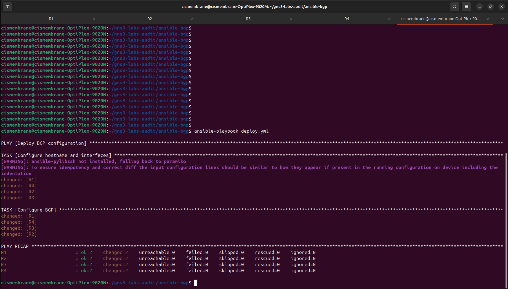
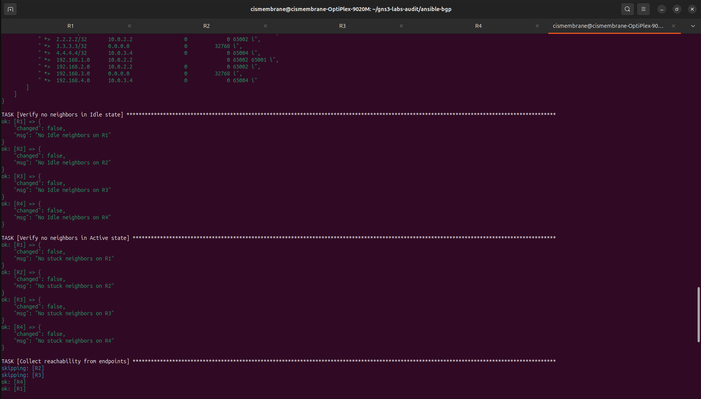
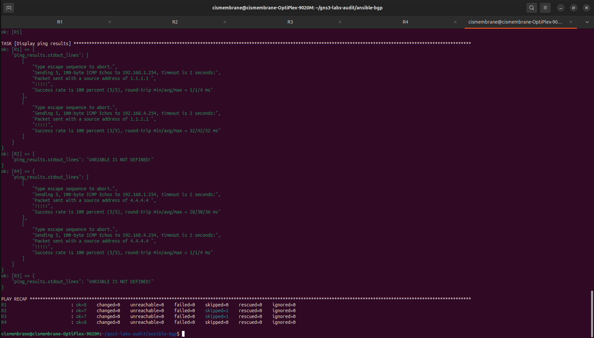

# BGP Deployment with Ansible

Four Cisco c7200 routers in a linear BGP chain, one AS per router. Ansible pushes interface addressing and BGP config through Jinja2 templates. A separate verification playbook checks neighbor state and pings across the full path. Built in GNS3.

## Topology

R1 through R4 in sequence. Each router sits in its own autonomous system.

```
  [R1]---[R2]---[R3]---[R4]
 AS 65001  AS 65002  AS 65003  AS 65004

  R1 Fa0/0  10.0.1.1 ----[ 10.0.1.0/29 ]---- 10.0.1.2  Fa0/0  R2
  R2 Fa1/0  10.0.2.2 ----[ 10.0.2.0/29 ]---- 10.0.2.3  Fa1/0  R3
  R3 Fa1/1  10.0.3.3 ----[ 10.0.3.0/29 ]---- 10.0.3.4  Fa1/1  R4
```

Every router has a Loopback0 used as its BGP router-id (X.X.X.X/32, matching the router number), a management interface on FastEthernet3/0 (192.168.0.0/24), and a LAN segment on FastEthernet3/1 (192.168.X.0/24). Each router advertises its loopback and LAN prefix into BGP.


## Project Structure

```
ansible-bgp/
├── .gitignore
├── ansible.cfg
├── ansible-bgp.gns3
├── inventory.yml
├── deploy.yml
├── verify.yml
├── configs/
│   ├── R1-config.txt
│   ├── R2-config.txt
│   ├── R3-config.txt
│   └── R4-config.txt
├── group_vars/
│   └── routers.yml
├── host_vars/
│   ├── R1.yml
│   ├── R2.yml
│   ├── R3.yml
│   └── R4.yml
├── images/
│   ├── gns3-topology.png
│   ├── deploy-output.png
│   ├── verify-output-1.png
│   └── verify-output-2.png
└── templates/
    ├── interfaces.j2
    └── bgp.j2
```

The `configs/` directory holds post-deployment running configs captured from each router.

## How It Works

The inventory puts R1 through R4 under a single `routers` group, each reachable on its management IP (192.168.0.1 through .4). Connection parameters in `group_vars/routers.yml` set `cisco.ios.ios` as the network OS and `network_cli` as the connection plugin, with enable mode credentials.

Each router's host_vars file defines its hostname, router-id, ASN, interfaces, BGP neighbors, and network statements. The `interfaces.j2` template configures the hostname, interface descriptions, IP addressing, and `no shutdown` on every listed interface. The `bgp.j2` template configures the full BGP process: router-id, neighbor statements with remote-as and descriptions, and the IPv4 unicast address-family with network and neighbor activate statements.

`deploy.yml` runs two tasks against all routers. First task pushes the interfaces template, second pushes the BGP template. Both use `cisco.ios.ios_config` with the `src` parameter pointing at the Jinja2 file.

`verify.yml` collects `show ip bgp summary` and `show ip bgp` from every router and prints the output. Two assert tasks check that no neighbor is stuck in Idle or Active state. On R1 and R4, it pings the opposite end's LAN gateway (R1 pings 192.168.4.254, R4 pings 192.168.1.254) sourced from the local router-id to confirm end-to-end reachability across the full BGP path.

## Running the Lab

1. Start the GNS3 topology. Confirm all four routers respond on their management IPs.
2. Deploy:
   ```
   ansible-playbook deploy.yml
   ```
3. Verify:
   ```
   ansible-playbook verify.yml
   ```

## Prerequisites

Ansible with the `cisco.ios` and `ansible.netcommon` collections installed. GNS3 running c7200 images (IOS 15.3) with management connectivity to the Ansible control node over 192.168.0.0/24.

### Router Bootstrap (before first playbook run)

Ansible connects over SSH, so each router needs SSH enabled manually before the playbooks can reach it. On each router, configure the following (swap the hostname per device):

```
conf t
hostname R1
ip domain-name lab
crypto key generate rsa modulus 1024
username admin privilege 15 secret admin
enable secret admin
line vty 0 15
 login local
 transport input ssh
interface FastEthernet3/0
 ip address 192.168.0.1 255.255.255.0
 no shutdown
end
```

The hostname and domain name are both required before IOS will generate RSA keys. The credentials here match what `group_vars/routers.yml` expects. Swap the hostname and management IP per router (192.168.0.1 through .4).

### SSH Cipher Compatibility

The c7200 on IOS 15.3 only offers CBC-mode ciphers and legacy key exchange algorithms. Modern OpenSSH clients (Ubuntu 22.04+) reject these by default. Add the following to `~/.ssh/config` on the Ansible control node:

```
Host 192.168.0.*
    KexAlgorithms +diffie-hellman-group14-sha1
    HostKeyAlgorithms +ssh-rsa
    PubkeyAcceptedAlgorithms +ssh-rsa
    Ciphers +aes128-cbc,aes256-cbc,3des-cbc
    User admin
```

Alternatively, set it in `group_vars/routers.yml` so the workaround travels with the project instead of depending on local SSH config:

```yaml
ansible_ssh_common_args: >-
  -o KexAlgorithms=+diffie-hellman-group14-sha1
  -o HostKeyAlgorithms=+ssh-rsa
  -o PubkeyAcceptedAlgorithms=+ssh-rsa
  -o Ciphers=+aes128-cbc,aes256-cbc,3des-cbc
```

Verify SSH works interactively (`ssh admin@192.168.0.1`) before running Ansible. If the connection works manually, Ansible will work.

## Verification

Successful deploy.yml run pushing interface and BGP configuration to all four routers:



Successful verify.yml run confirming no BGP neighbors stuck in Idle or Active state:



Ping results from R1 and R4 confirming end-to-end reachability, and the play recap:



## Notes

The `bgp.j2` template renders network statements with explicit masks (e.g., `network 192.168.1.0 mask 255.255.255.0`), but IOS stores them without the mask keyword when the mask matches the classful default. `network 192.168.1.0` in the running config and `network 192.168.1.0 mask 255.255.255.0` in the template are the same statement. IOS strips the redundant mask on commit.