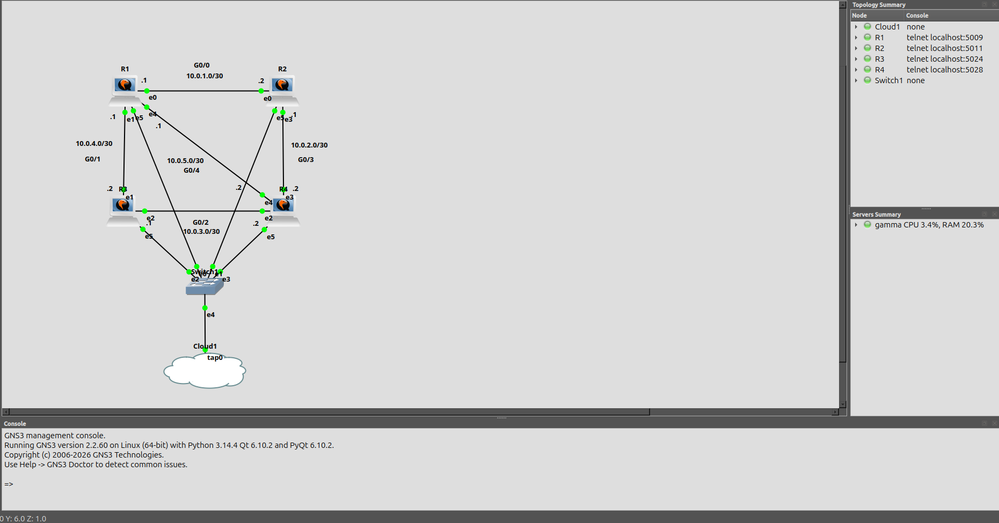

# Ansible OSPF Deployment on Cisco 7200 Routers in GNS3

## Walkthrough

YouTube walkthrough: https://youtu.be/7IEfZew-7wQ

## Overview

This lab uses Ansible to build a four-router OSPF topology in GNS3 on Cisco IOSv. The workflow starts by pushing a base management baseline, then moves the routed links onto physical interfaces, runs a precheck to confirm interface state and platform reachability, deploys OSPF from a Jinja template, and validates neighbor formation and protocol state from all four routers.

The goal of this is to take a GNS3 topology, apply a basic configuration to allow Ansible to connect, and then push interface and OSPF configuration.

## What this lab does

This lab demonstrates a few things working together:

- Jinja-based OSPF config rendering
- Routed point-to-point links placed on physical interfaces
- A clean deployment flow: base config, interface config, precheck, OSPF deploy, OSPF validation
- Local capture of validation output for each router

## Topology

The lab is built around four routers named `R1` through `R4`, each with a management interface on the `172.16.99.0/24` network and multiple routed transit links using /30s.

From the host variable files and validation output, the routed topology is:

- `R1` to `R2` on `10.0.1.0/30`
- `R2` to `R4` on `10.0.2.0/30`
- `R3` to `R4` on `10.0.3.0/30`
- `R1` to `R3` on `10.0.4.0/30`
- `R1` to `R4` on `10.0.5.0/30`

Management addressing is:

- `R1` `FastEthernet3/1` -> `172.16.99.11/24`
- `R2` `FastEthernet3/1` -> `172.16.99.12/24`
- `R3` `FastEthernet3/1` -> `172.16.99.13/24`
- `R4` `FastEthernet3/1` -> `172.16.99.14/24`

```text
      ┌─────────┐                                   ┌─────────┐
      │         │                                   │         │
      │   R1    │            10.0.1.0/30            │   R2    │
      │         ┼───────────────────────────────────┼         │
      │         │                                   │         │
      └────┬────┘                                   └────┬────┘
           │                                             │
           │                                             │
           │                                             │
     │ 10.0.4.0/30                     10.0.2.0/30 │
           │                                             │
           │                                             │
           │                                             │
           │                                             │
      ┌────┼────┐                                   ┌────┼────┐
      │         │                                   │         │
      │   R3    │                                   │   R4    │
      │         ┼───────────────────────────────────┼         │
      │         │            10.0.3.0/30            │         │
      └─────────┘                                   └─────────┘
     Additional: R1-R4 10.0.5.0/30
```



## Tools used

- Ansible Core 2.16.3
- Ubuntu
- GNS3
- Cisco IOSv`
- Jinja2 template rendering

## Project Structure

```
ansible-ospf/
├── ansible.cfg
├── inventory-ios.ini
├── command_line_output.txt          # raw CLI capture from deployment
├── notes.txt                        # working notes (text file)
├── gns3/
│   └── ansible-ospf.gns3
├── group_vars/
│   └── ios.yml                      # shared OSPF settings, credentials, validation commands
├── host_vars/
│   ├── R1.yml
│   ├── R2.yml
│   ├── R3.yml
│   └── R4.yml
├── playbooks/
│   ├── base-config.yml
│   ├── interface-config.yml
│   ├── precheck.yml
│   ├── ospf-deploy.yml
│   ├── ospf-validate.yml
│   └── command_line_output.txt      # raw CLI capture from playbook runs
├── outputs/
│   ├── R1-ospf-validation.txt
│   ├── R2-ospf-validation.txt
│   ├── R3-ospf-validation.txt
│   └── R4-ospf-validation.txt
├── screenshots/
│   └── GNS3_Screenshot.png
└── templates/
    └── ospf-router.j2
```

## How the lab is structured

`ansible.cfg` sets the local inventory, turns off host key checking, uses the YAML stdout callback, and sets connection and command timeouts.

`inventory-ios.ini` defines the four routers and sets the connection model for Cisco IOS.

`group_vars/ios.yml` holds shared OSPF settings and validation commands.

Each router has its own `host_vars` file. That is where per-device intent lives:

- OSPF router ID
- routed transit interfaces
- OSPF network statements

The playbooks break the deployment into stages:

- `playbooks/base-config.yml` pushes the common management and access baseline
- `playbooks/interface-config.yml` applies management and IP addressing to physical interfaces
- `playbooks/precheck.yml` confirms interface state and basic platform visibility
- `playbooks/ospf-deploy.yml` renders OSPF config from `templates/ospf-router.j2` and pushes it
- `playbooks/ospf-validate.yml` runs the OSPF checks and saves the output locally under `outputs/`

The OSPF template is simple on purpose. It builds `router ospf {{ ospf_process_id }}`, sets the router ID, then loops through `ospf_networks` for each router. Passive interfaces are supported in the template, but in this lab all `ospf_passive_interfaces` lists are empty.

## Deployment workflow

The lab was deployed in this order:

- `ansible-playbook playbooks/base-config.yml`
- `ansible-playbook playbooks/interface-config.yml`
- `ansible-playbook playbooks/precheck.yml`
- `ansible-playbook playbooks/ospf-deploy.yml`
- `ansible-playbook playbooks/ospf-validate.yml`

### 1. Base config

The base playbook does the initial cleanup and management prep across all four routers.

The base config then applies:

- `no ip domain-lookup`
- `ip ssh authentication-retries 3`

The actual playbook also includes service timestamps, login success/failure logging, ip ssh version 2, and ip ssh time-out 60.

Console and VTY access are standardized:

- console timeout set to 10 minutes
- VTY transport locked to SSH
- VTY timeout set to 15 minutes

### 2. Interface config

The interface playbook first asserts that each router has the required management and routed interface data in host_vars. All assertions passed.

After that it pushes all transit links as routed physical interfaces. This lab initially used IOSvL2 images.

The resulting interface layout was:

R1

- GigabitEthernet0/0  10.0.1.1/30
- GigabitEthernet0/1  10.0.4.1/30
- GigabitEthernet0/4  10.0.5.1/30
- GigabitEthernet0/5  172.16.99.11/24

R2

- GigabitEthernet0/0  10.0.1.2/30
- GigabitEthernet0/3  10.0.2.1/30
- GigabitEthernet0/5  172.16.99.12/24

R3

- GigabitEthernet0/1  10.0.4.2/30
- GigabitEthernet0/2  10.0.3.1/30
- GigabitEthernet0/5  172.16.99.13/24

R4

- GigabitEthernet0/2  10.0.3.2/30
- GigabitEthernet0/3  10.0.2.2/30
- GigabitEthernet0/4  10.0.5.2/30
- GigabitEthernet0/5  172.16.99.14/24

The sanity check after interface deployment confirmed that the interfaces were up/up and that each router had the expected connected routes for its local /30 links plus the management subnet.

### 3. Precheck

The precheck playbook runs the command:

- `show ip interface brief`

This confirms that the interface state is where is should be after interface deployment.

At this point, the network is built at Layer 3 but OSPF is not yet deployed.

### 4. OSPF deployment

The OSPF deploy playbook renders the router process config from templates/ospf-router.j2 using shared group vars and router-specific host vars.

Rendered examples from the run:

R1

- `router ospf 1`
- `router-id 1.1.1.1`
- `network 10.0.1.0 0.0.0.3 area 0`
- `network 10.0.4.0 0.0.0.3 area 0`
- `network 10.0.5.0 0.0.0.3 area 0`

R4

- `router ospf 1`
- `router-id 4.4.4.4`
- `network 10.0.5.0 0.0.0.3 area 0`
- `network 10.0.2.0 0.0.0.3 area 0`
- `network 10.0.3.0 0.0.0.3 area 0`

Every router reported Changed: True, which makes sense because this looks like the first OSPF push in the sequence.

### 5. OSPF validation

The validation playbook runs the command set defined in group_vars/ios.yml:

- `show ip ospf neighbor`
- `show ip route ospf`
- `show ip protocols`

It prints the output for each router and also saves a local file per device:

- `outputs/R1-ospf-validation.txt`
- `outputs/R2-ospf-validation.txt`
- `outputs/R3-ospf-validation.txt`
- `outputs/R4-ospf-validation.txt`

### Validation

The validation output shows that OSPF formed neighbors on every expected transit link.

Neighbor state

R1 sees three neighbors:

- 2.2.2.2 on 10.0.1.2
- 3.3.3.3 on 10.0.4.2
- 4.4.4.4 on 10.0.5.2

R2 sees two neighbors:

- 1.1.1.1 on 10.0.1.1
- 4.4.4.4 on 10.0.2.2

R3 sees two neighbors:

- 1.1.1.1 on 10.0.4.1
- 4.4.4.4 on 10.0.3.2

R4 sees three neighbors:

- 1.1.1.1 on 10.0.5.1
- 2.2.2.2 on 10.0.2.1
- 3.3.3.3 on 10.0.3.1

OSPF process state

`show ip protocols` confirms on all four routers that:

- OSPF process ID is 1
- area is 0
- router IDs are correct
- the correct network statements were applied per router

### Results

The lab deployed cleanly.

Base config:

- all four routers reachable
- all four routers updated
- no unreachable hosts
- no failed tasks

Interface config:

- all required host variables present
- transit interfaces configured successfully
- connected route sanity check matched the intended per-router links

Precheck:

- all four routers responded

OSPF deploy:

- OSPF process pushed successfully to all four routers
- all four routers reported changes

OSPF validation:

- all four routers returned neighbor and protocol output successfully
- local validation artifacts were written for all four routers
- no failures or unreachable devices

### Notes

This repo was originally written using Cisco c7200 routers. This was later changed to Cisco IOSv routers, requiring the interfaces to be renumbered. In addition, the playbooks were substantially changed to improve the deployment. Portions that were not necessary were removed from several playbooks. The deployment sequence remains the same for the updated IOSv version.
