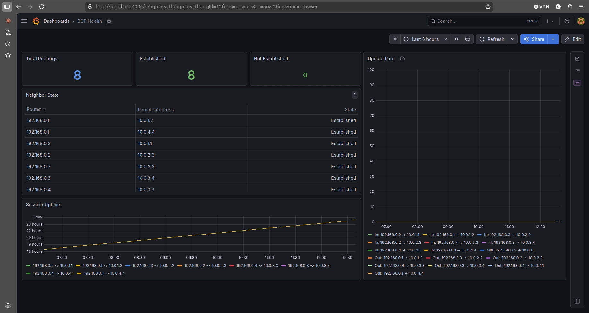
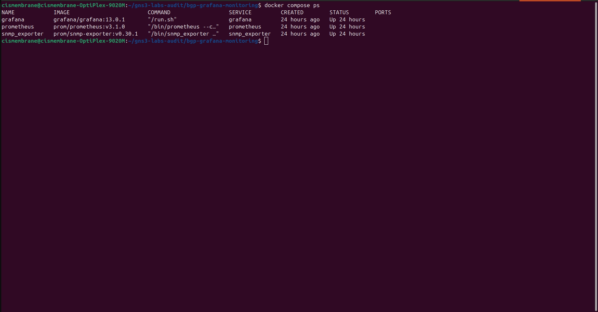
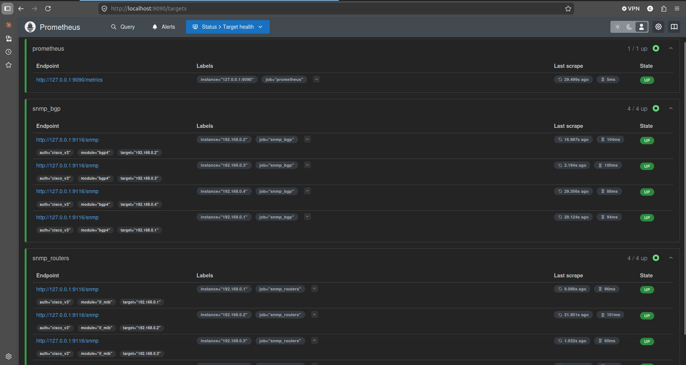

# BGP Observability with SNMPv3, Prometheus, and Grafana

Monitoring stack for a four-router eBGP GNS3 lab (AS 65001–65004). SNMPv3 polling into snmp_exporter, scraped by Prometheus, rendered in Grafana. Six dashboard panels cover peer state, session uptime, and update rates across all eight directional peerings.

Router config is built by Ansible. The monitoring stack runs from `docker-compose.yml`. Both are in this repo.

---

## Dashboard Preview



---

## Topology and Data Flow

Four routers peer in a ring: R1 (AS 65001) ↔ R2 (AS 65002) ↔ R3 (AS 65003) ↔ R4 (AS 65004) ↔ R1. Every router holds two eBGP sessions, so SNMP reports eight directional peering states total.

Prometheus runs three scrape jobs. Two go to snmp_exporter: the `snmp_routers` job requests the `if_mib` module for interface counters and state, and the `snmp_bgp` job requests the `bgp4` module for BGP4-MIB entries covering peer state, uptime, and update counters. Both reference the `cisco_v3` auth profile in `snmp.yml`. The third job scrapes Prometheus itself at `127.0.0.1:9090`. Global `scrape_interval` is 30 seconds, which triggers a fresh SNMP walk against each target router on every cycle. Grafana reads from Prometheus via PromQL and renders the dashboard at `monitoring/grafana/dashboards/bgp-health.json`.

SNMPv3 is used instead of v2c so auth and priv are in play. The difference doesn't matter inside a lab, but I'd rather not have a plaintext community string pattern sitting in a public repo.

---

## Topology and Data Flow


---

## Deployment

The routers are configured first. Three Ansible playbooks run in sequence: `deploy.yml` pushes interface and BGP config, `verify.yml` confirms sessions are established and end-to-end loopback pings across the ring succeed, and `configure-snmp.yml` enables SNMPv3. Once SNMPv3 is listening, the monitoring stack stands up via `docker-compose.yml`.

Three services in `docker-compose.yml`: `snmp_exporter` v0.30.1, `prometheus` v3.1.0, `grafana` 13.1.0. All run with `network_mode: host` because the containers need to reach the GNS3 routers' management IPs, which live on the host's network. Host mode means SNMP polls leave the host's stack directly, with no bridge routing or port mapping to fight. Prometheus scrapes over localhost to `:9116`, and Grafana listens on host `:3000`.

`./monitoring/grafana/provisioning` is mounted into the Grafana container, so the Prometheus datasource and `bgp-health.json` dashboard load on startup without any UI clicking.

**Running the deployment.** Prerequisites: GNS3 project running with R1–R4 reachable at 192.168.0.1–4, Ansible with the `cisco.ios` collection, and Docker with compose. Then:

1. `ansible-playbook deploy.yml` pushes interface and BGP config.
2. `ansible-playbook verify.yml` confirms sessions and ring reachability.
3. `ansible-playbook configure-snmp.yml` enables SNMPv3.
4. `docker compose up -d` starts snmp_exporter, Prometheus, and Grafana.

Grafana is at `http://localhost:3000`, login `admin`/`admin`.

The SNMPv3 credentials in `group_vars/routers.yml` (`snmp_user`, `snmp_auth_pass`, `snmp_priv_pass`) have to match the `cisco_v3` auth profile in `monitoring/snmp_exporter/snmp.yml`. If they drift, polling fails and BGP panels show empty.

---

## Repository Layout

```
bgp-grafana-monitoring/
├── ansible.cfg
├── configs/
│   ├── R1-post-deployment.txt
│   ├── R1-pre-deployment.txt
│   ├── R2-post-deployment.txt
│   ├── R2-pre-deployment.txt
│   ├── R3-post-deployment.txt
│   ├── R3-pre-deployment.txt
│   ├── R4-post-deployment.txt
│   └── R4-pre-deployment.txt
├── configure-snmp.yml
├── deploy.yml
├── docker-compose.yml
├── group_vars/
│   └── routers.yml
├── host_vars/
│   ├── R1.yml
│   ├── R2.yml
│   ├── R3.yml
│   └── R4.yml
├── images/
├── inventory.yml
├── monitoring/
│   ├── grafana/
│   │   ├── dashboards/
│   │   │   └── bgp-health.json
│   │   └── provisioning/
│   │       ├── dashboards/
│   │       │   └── default.yml
│   │       └── datasources/
│   │           └── prometheus.yml
│   ├── prometheus/
│   │   └── prometheus.yml
│   └── snmp_exporter/
│       └── snmp.yml
├── README.md
├── scripts/
│   └── strip-dashboard.sh
├── templates/
│   ├── bgp.j2
│   ├── interfaces.j2
│   └── snmp.j2
└── verify.yml
```

**Ansible entry points.** `deploy.yml` uses `cisco.ios.ios_config` to render `interfaces.j2` and `bgp.j2` in that order and push each result to the router's running-config. `verify.yml` collects BGP summary and table output, asserts no neighbors are in Idle or Active, and runs loopback-to-loopback pings across the ring diagonals (R1↔R3, R2↔R4) to confirm end-to-end reachability. `configure-snmp.yml` pushes `snmp.j2` via `cisco.ios.ios_config` to enable SNMPv3, then collects `show snmp group/user/host` and the ACL, asserting the `MONITORING` group and trap destination are present before the play exits. None of the playbooks save to startup-config, so router reloads drop the config.

**Variables.** `host_vars/R{1-4}.yml` carry per-router state: hostname, router ID, ASN, interface table, BGP neighbors, advertised networks. `group_vars/routers.yml` carries everything shared across the fleet: Ansible connection settings, SNMPv3 credentials (user, auth and priv passphrases), the ACL network and wildcard, and the trap destination. Credentials are currently in plaintext and marked for vault-ing as a cleanup item.

**Templates.** `interfaces.j2` builds the hostname and interface stanzas, including the `description` that ends up in `ifAlias`. `bgp.j2` builds the BGP process with neighbors, descriptions, and advertised prefixes. `snmp.j2` builds the ACL, the SNMPv3 view/group/user, the trap host, and `snmp-server location` (set to the hostname, which is how the instance labels trace back to specific routers).

**Config captures.** `configs/R{1-4}-pre-deployment.txt` and `configs/R{1-4}-post-deployment.txt` are raw `show run` captures from each router before any Ansible ran and after the full sequence (`deploy.yml`, `verify.yml`, `configure-snmp.yml`) completed. Kept for diffing the applied state against the original.

**Monitoring config.** `prometheus.yml` defines the three scrape jobs (two against snmp_exporter, one for Prometheus itself). `snmp.yml` holds the `cisco_v3` auth profile (SHA auth, AES priv, `authPriv` security level) and the two modules. The `if_mib` module walks the interface tables and attaches `ifDescr` and `ifAlias` as lookup labels on the counter and status metrics. The `bgp4` module walks BGP4-MIB for peer state, admin status, remote ASN, in/out update counters, and FSM established time, indexed by `bgpPeerRemoteAddr` only. There's no ifIndex correlation in BGP4-MIB, so `ifAlias` does not propagate to BGP series. BGP panels label by peer IP. The Grafana directory holds the exported dashboard JSON and the provisioning files that auto-load the datasource and dashboard on container start.

**`scripts/strip-dashboard.sh`.** `jq` wrapper that removes Grafana's instance-specific metadata (UIDs, resource versions, timestamps, user references) from an exported dashboard JSON. Run it against a fresh export before committing so the repo only tracks the dashboard content, not the state of whatever Grafana instance produced it.

---

## Dashboard Panels

Six panels: three stat counters across the top, a Neighbor State table in the middle, a Session Uptime time series along the bottom, and an Update Rate time series down the right side. All queries pull from the `bgp4` module and key off `bgpPeerRemoteAddr`. The `instance` label is each router's management IP (192.168.0.1–4).

**Total Peerings.** Counts every row returned by `bgpPeerState`. Reads 8.

**Established / Not Established.** Two stats splitting the peer count by state. Established counts peers where `bgpPeerState == 6`. Not Established covers everything else (Idle, Connect, Active, OpenSent, OpenConfirm). The ring reads 8/0 when healthy.

**Neighbor State.** Table with Router, Remote Address, and State columns. State integers from `bgpPeerState` are mapped to the readable names (Established, Active, Idle, etc.) so the column reads as text.

**Session Uptime.** Time series of `bgpPeerFsmEstablishedTime` per peering, Y axis in days. Lines stay flat at the session age. A drop to zero and climb back up means the session reset.

**Update Rate.** Time series of `rate(bgpPeerInUpdates[5m])` and `rate(bgpPeerOutUpdates[5m])`, both directions per peering, 16 series total. Zero when nothing is changing. Nonzero during convergence or topology changes.

---

## Lab Validation




