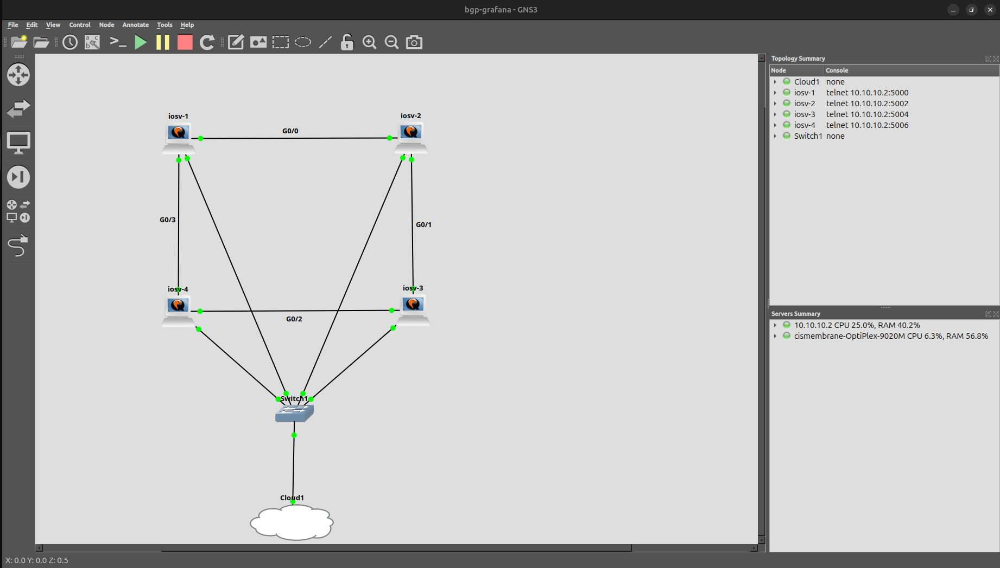

# GNS3 Project Files

This directory contains the GNS3 project files for the four-router eBGP observability lab used by this repo.

The GNS3 topology provides the network side of the project. Ansible configures the routers, SNMPv3 exposes router state, Prometheus scrapes the SNMP exporter, and Grafana renders the BGP dashboard.

The main README covers the full monitoring stack. This README focuses only on rebuilding and using the GNS3 topology.

---

## Topology

The lab uses a four-router eBGP ring:

```text
R1 AS 65001 <-> R2 AS 65002 <-> R3 AS 65003 <-> R4 AS 65004 <-> R1 AS 65001
```

Each router has two eBGP neighbors. The full ring produces eight directional BGP peerings in SNMP and Grafana.



---

## Interface and IP Mapping

Use this section if you need to recreate the GNS3 topology manually.

The lab is a four-router eBGP ring. The physical link mapping, interface names, transit subnets, and BGP neighbor IPs need to match the Ansible `host_vars/` files and saved router configs.


### Physical Link Map

| Link     | Router A | Interface          | IP Address  | Router B | Interface          | IP Address  | Transit Subnet |
|----------|----------|--------------------|-------------|----------|--------------------|-------------|----------------|
| R1 to R2 | R1       | GigabitEthernet0/0 | 10.0.1.1/29 | R2       | GigabitEthernet0/0 | 10.0.1.2/29 | 10.0.1.0/29    |
| R2 to R3 | R2       | GigabitEthernet0/1 | 10.0.2.2/29 | R3       | GigabitEthernet0/1 | 10.0.2.3/29 | 10.0.2.0/29    |
| R3 to R4 | R3       | GigabitEthernet0/2 | 10.0.3.3/29 | R4       | GigabitEthernet0/2 | 10.0.3.4/29 | 10.0.3.0/29    |
| R4 to R1 | R4       | GigabitEthernet0/3 | 10.0.4.4/29 | R1       | GigabitEthernet0/3 | 10.0.4.1/29 | 10.0.4.0/29    |

This creates the full eBGP ring:

```text
R1 -> R2 -> R3 -> R4 -> R1
```

### BGP Neighbor Map

| Router | Local AS | Neighbor | Neighbor AS | Neighbor IP |
|--------|----------|----------|-------------|-------------|
| R1     | 65001    | R2       | 65002       | 10.0.1.2    |
| R1     | 65001    | R4       | 65004       | 10.0.4.4    |
| R2     | 65002    | R1       | 65001       | 10.0.1.1    |
| R2     | 65002    | R3       | 65003       | 10.0.2.3    |
| R3     | 65003    | R2       | 65002       | 10.0.2.2    |
| R3     | 65003    | R4       | 65004       | 10.0.3.4    |
| R4     | 65004    | R3       | 65003       | 10.0.3.3    |
| R4     | 65004    | R1       | 65001       | 10.0.4.1    |

### Management Address Map

The rest of the repo expects these management addresses:

| Router | Management Interface | Management IP  |
|--------|----------------------|----------------|
| R1     | GigabitEthernet0/4   | 192.168.0.1/24 |
| R2     | GigabitEthernet0/4   | 192.168.0.2/24 |
| R3     | GigabitEthernet0/4   | 192.168.0.3/24 |
| R4     | GigabitEthernet0/4   | 192.168.0.4/24 |

These addresses are used by Ansible inventory and Prometheus scrape targets.

---

## Included Files

This directory contains the exported GNS3 project files needed to rebuild the lab topology.

The project files define the router layout and links. They do not include Cisco IOS images.

---

## Requirements

Before importing the project, make sure GNS3 has the required router image available locally.

This project expects:

- Four Cisco router nodes named `R1`, `R2`, `R3`, and `R4`
- Router management reachability from the Ansible control host
- Management IPs reachable at `192.168.0.1` through `192.168.0.4`
- The same interface mapping used by the Ansible `host_vars/` files

Cisco IOS images are not included in this repo.

---

## Importing the Project

Import the portable GNS3 project from this directory.

In GNS3:

1. Open GNS3.
2. Go to `File` > `Import portable project`.
3. Select the project file from this directory.
4. Confirm that all four routers load correctly.
5. Start the routers.
6. Copy and paste the pre-deployment configs for each router.
7. Confirm that SSH works for `192.168.0.1`, `192.168.0.2`, `192.168.0.3`, and `192.168.0.4`.

After the topology is running, apply one of the router configuration paths below.

---

## Router Configuration Paths

There are two ways to bring the routers into the expected lab state.

The intended path is:

```text
initial router config -> Ansible deployment -> verified BGP/SNMP state
```

The fallback path is:

```text
paste completed post-deployment configs -> verify BGP/SNMP state
```

Ansible does not configure completely blank routers from zero. Each router needs an initial bootstrap config first so the Ansible control host can reach it over SSH.

---

## Option 1: Bootstrap the Routers, Then Run Ansible

Use this path if you want to follow the intended automation workflow.

The initial router configs are stored in the main repo under:

```text
../configs/R1-pre-deployment.txt
../configs/R2-pre-deployment.txt
../configs/R3-pre-deployment.txt
../configs/R4-pre-deployment.txt
```

Paste the matching pre-deployment config into each router first:

```text
R1 -> ../configs/R1-pre-deployment.txt
R2 -> ../configs/R2-pre-deployment.txt
R3 -> ../configs/R3-pre-deployment.txt
R4 -> ../configs/R4-pre-deployment.txt
```

To apply the initial config manually, open the router console and enter configuration mode:

```text
enable
configure terminal
```

Then paste the matching pre-deployment config into the matching router.

After all four initial configs are applied, confirm the Ansible control host can reach each router:

```text
ping 192.168.0.1
ping 192.168.0.2
ping 192.168.0.3
ping 192.168.0.4
```

Confirm SSH reachability before running the playbooks:

```text
ssh admin@192.168.0.1
ssh admin@192.168.0.2
ssh admin@192.168.0.3
ssh admin@192.168.0.4
```

Once the routers are reachable, return to the repo root and run the normal deployment sequence:

```text
ansible-playbook deploy.yml
ansible-playbook verify.yml
ansible-playbook configure-snmp.yml
docker compose up
```

The pre-deployment configs provide management access. The Ansible playbooks build the lab state from there.

---

## Option 2: Paste the Completed Router Configs

Use this path if you want to rebuild the finished lab state without running Ansible.

The completed post-deployment configs are stored in the main repo under:

```text
../configs/R1-post-deployment.txt
../configs/R2-post-deployment.txt
../configs/R3-post-deployment.txt
../configs/R4-post-deployment.txt
```

Paste the matching completed config into each router:

```text
R1 -> ../configs/R1-post-deployment.txt
R2 -> ../configs/R2-post-deployment.txt
R3 -> ../configs/R3-post-deployment.txt
R4 -> ../configs/R4-post-deployment.txt
```

To apply the completed config manually, open the router console and enter configuration mode:

```text
enable
configure terminal
```

Then paste the matching post-deployment config into the matching router.

This skips the automation path and puts the routers directly into the finished lab state.

---

## Rebuilding the Topology Manually

If the imported GNS3 project does not open cleanly, recreate the topology manually with four router nodes named exactly:

```text
R1
R2
R3
R4
```

Wire the routers using the physical link map above. The important part is keeping the logical links and interface order the same:

```text
R1 Gi0/0 <-> R2 Gi0/0
R2 Gi0/1 <-> R3 Gi0/1
R3 Gi0/2 <-> R4 Gi0/2
R4 Gi0/3 <-> R1 Gi0/3
```

Connect each router's `GigabitEthernet0/4` interface to the management network so the Ansible control host can reach:

```text
R1 192.168.0.1
R2 192.168.0.2
R3 192.168.0.3
R4 192.168.0.4
```

After the links are rebuilt, use Option 1 or Option 2 above to configure the routers.

---

## Verification

After either configuration path, verify the router state from the Ansible control host:

```text
ansible-playbook verify.yml
```

You can also verify directly from the router consoles:

```text
show ip interface brief
show ip bgp summary
show running-config | section router bgp
show snmp user
```

Each router should show two established eBGP neighbors once the full ring is configured.

After SNMPv3 is configured and the monitoring stack is running, Prometheus should show the SNMP scrape jobs in the `UP` state at:

```text
http://localhost:9090/targets
```

Grafana should be available at:

```text
http://localhost:3000
```

Default login:

```text
admin / admin
```

---

## Notes

If the project does not open cleanly on another system, recreate the four router nodes manually using the same names and interface links, then apply one of the router configuration paths above.

The Ansible workflow depends on initial management reachability. The automation starts after the routers can already be reached over SSH.

If a different router image exposes different interface names, keep the same logical links and update the interface names in the configs and host variable files.

Files to check if the topology changes:

```text
../host_vars/R1.yml
../host_vars/R2.yml
../host_vars/R3.yml
../host_vars/R4.yml
../configs/R1-pre-deployment.txt
../configs/R2-pre-deployment.txt
../configs/R3-pre-deployment.txt
../configs/R4-pre-deployment.txt
../configs/R1-post-deployment.txt
../configs/R2-post-deployment.txt
../configs/R3-post-deployment.txt
../configs/R4-post-deployment.txt
../monitoring/prometheus/prometheus.yml
```

