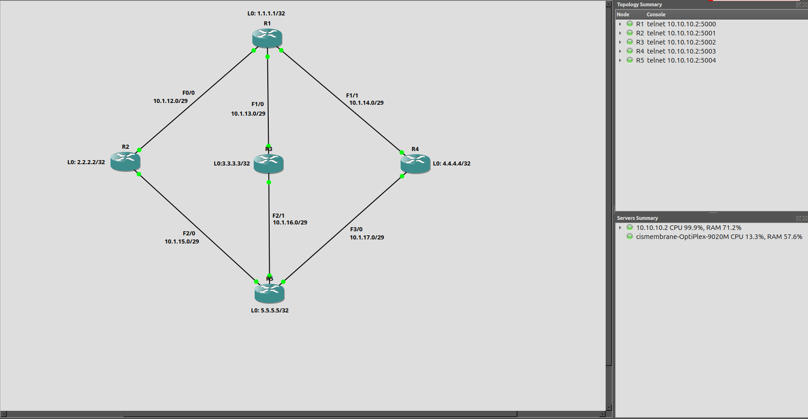

# EIGRP Path Selection via Interface Delay Manipulation

EIGRP calculates path preference using a composite metric that includes cumulative interface delay. This lab builds a five-router topology with three equal-cost paths between R5 and R1, then raises the delay on one transit interface to force EIGRP to drop that path from the routing table.

## Topology

Five routers in a diamond layout. R1 sits at the top, R5 at the bottom, and R2, R3, R4 bridge the two in parallel. Each middle router connects only to R1 and R5.
```
                                [R1]
                           Lo0: 1.1.1.1/32
                          /      |       \
                         /       |        \
                       [R2]    [R3]     [R4]
                  Lo0: 2.2.2.2  3.3.3.3  4.4.4.4
                         \       |        /
                          \      |       /
                              [R5]
                           Lo0: 5.5.5.5/32
```




R5 reaches R1 through three parallel two-hop paths: R5 to R2 to R1, R5 to R3 to R1, and R5 to R4 to R1. All transit links are /29 subnets. Each router has a loopback interface used as its EIGRP router-id.

## Interface Addressing

Host octets follow the router number (.1 for R1, .2 for R2, etc.) across every subnet.

| Router | Interface       | IP Address     | Subnet         | Peer   |
| ------ | --------------- | -------------- | -------------- | ------ |
| R1     | Loopback0       | 1.1.1.1        | /32            |        |
| R1     | FastEthernet0/0 | 10.1.12.1      | 10.1.12.0/29   | R2     |
| R1     | FastEthernet1/0 | 10.1.13.1      | 10.1.13.0/29   | R3     |
| R1     | FastEthernet1/1 | 10.1.14.1      | 10.1.14.0/29   | R4     |
| R2     | Loopback0       | 2.2.2.2        | /32            |        |
| R2     | FastEthernet0/0 | 10.1.12.2      | 10.1.12.0/29   | R1     |
| R2     | FastEthernet2/0 | 10.1.15.2      | 10.1.15.0/29   | R5     |
| R3     | Loopback0       | 3.3.3.3        | /32            |        |
| R3     | FastEthernet1/0 | 10.1.13.3      | 10.1.13.0/29   | R1     |
| R3     | FastEthernet2/1 | 10.1.16.3      | 10.1.16.0/29   | R5     |
| R4     | Loopback0       | 4.4.4.4        | /32            |        |
| R4     | FastEthernet1/1 | 10.1.14.4      | 10.1.14.0/29   | R1     |
| R4     | FastEthernet3/0 | 10.1.17.4      | 10.1.17.0/29   | R5     |
| R5     | Loopback0       | 5.5.5.5        | /32            |        |
| R5     | FastEthernet2/0 | 10.1.15.5      | 10.1.15.0/29   | R2     |
| R5     | FastEthernet2/1 | 10.1.16.5      | 10.1.16.0/29   | R3     |
| R5     | FastEthernet3/0 | 10.1.17.5      | 10.1.17.0/29   | R4     |

## EIGRP Configuration

All routers run EIGRP AS 100. Each advertises its loopback and all directly connected transit subnets. Router-ids are set explicitly to match loopback addresses.

| Router | Router-ID | Networks                                             |
| ------ | --------- | ---------------------------------------------------- |
| R1     | 1.1.1.1   | 1.1.1.1/32, 10.1.12.0/29, 10.1.13.0/29, 10.1.14.0/29 |
| R2     | 2.2.2.2   | 2.2.2.2/32, 10.1.12.0/29, 10.1.15.0/29               |
| R3     | 3.3.3.3   | 3.3.3.3/32, 10.1.13.0/29, 10.1.16.0/29               |
| R4     | 4.4.4.4   | 4.4.4.4/32, 10.1.14.0/29, 10.1.17.0/29               |
| R5     | 5.5.5.5   | 5.5.5.5/32, 10.1.15.0/29, 10.1.16.0/29, 10.1.17.0/29 |

## Steps

### 1. Confirm Baseline Routing on R5

On R5:
```
show ip route
```

Expected output:
```
D       1.1.1.1 [90/158720] via 10.1.16.3, FastEthernet2/1
                [90/158720] via 10.1.17.4, FastEthernet3/0
                [90/158720] via 10.1.15.2, FastEthernet2/0
```

Three equal-cost paths to R1's loopback, one through each middle router. The metrics are identical because every link in the topology uses the same bandwidth and default delay values.

### 2. Increase Delay on R3 FastEthernet1/0

R3's Fa1/0 faces R1 on the 10.1.13.0/29 link. Raising the delay on this interface increases the cumulative metric for any path that crosses it.

On R3:
```
configure terminal
interface FastEthernet1/0
 delay 10000
end
```

### 3. Verify the Change on R5

On R5:
```
show ip route
```

Expected output:
```
D       1.1.1.1 [90/158720] via 10.1.17.4, FastEthernet3/0
                [90/158720] via 10.1.15.2, FastEthernet2/0
```

The path through R3 (via 10.1.16.3) is gone. EIGRP recalculated the composite metric for that path, found it higher than the other two, and removed it from the routing table. R5 now load-balances across R2 and R4 only.