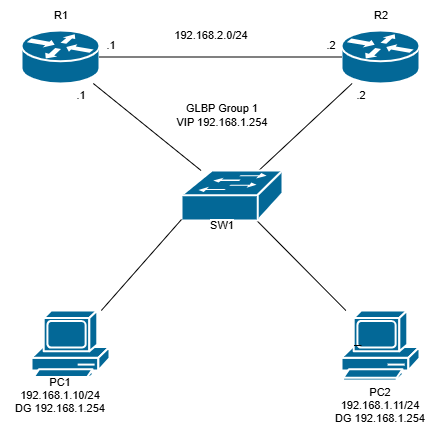

# GLBP Lab (Gateway Load Balancing Protocol)

## Lab Prerequisites

- GNS3 installed and functional
- Cisco IOS router images that support GLBP (c3660-a3jk9s-mz.124-15.T14.image was used for this lab)

## Lab Objective

Demonstrate the configuration and behavior of GLBP in a dual-router topology where client PCs share the load across multiple default gateways. Validate load balancing and failover functionality.

## Topology Diagram

```
             192.168.2.0/24
        Fa0/0             Fa0/0
     +---------------------------+
     |                           |
 +--------+                  +--------+
 |   R1   |                  |   R2   |
 +--------+                  +--------+
   Fa0/1 |                    | Fa0/1
         |   192.168.1.0/24   |
      +-----------------------------+
      |            SW1              |
      +-----------------------------+
       |                           |
 +--------+                  +--------+
 |  PC1   |                  |  PC2   |
 +--------+                  +--------+
```



## Topology Overview

R1 and R2 are both members of GLBP group 1 on the 192.168.1.0/24 LAN segment. They share a single virtual IP (192.168.1.254) that PC1 and PC2 use as their default gateway.

GLBP elects one router as the Active Virtual Gateway (AVG). The AVG is responsible for answering ARP requests for the virtual IP, but instead of always returning the same virtual MAC, it distributes multiple virtual MACs across the group members. Each router that owns a virtual MAC acts as an Active Virtual Forwarder (AVF) for that MAC. When round-robin load balancing is configured, the AVG hands out a different virtual MAC to each successive ARP request, spreading traffic across both routers without any client-side configuration.

The 192.168.2.0/24 link between R1 and R2 simulates an upstream or WAN segment. In a production deployment this would be the path toward external networks that clients reach through the GLBP virtual gateway.

## Lab Devices

| Device | Role      | IP Address   | Notes                       |
|--------|-----------|--------------|-----------------------------|
| PC1    | Client    | 192.168.1.10 | Default GW: 192.168.1.254   |
| PC2    | Client    | 192.168.1.11 | Default GW: 192.168.1.254   |
| R1     | Gateway 1 | 192.168.1.1  | GLBP AVG (priority 110)     |
| R2     | Gateway 2 | 192.168.1.2  | GLBP Standby / AVF          |
| SW1    | Switch    | None         | Connects all LAN devices    |

| Link        | Interface A | Interface B | Purpose                          |
|-------------|-------------|-------------|----------------------------------|
| R1 — R2     | R1 Fa0/0    | R2 Fa0/0    | Simulated upstream / WAN segment |
| SW1 — R1    | SW1 Eth2    | R1 Fa0/1    | LAN-side GLBP link               |
| SW1 — R2    | SW1 Eth3    | R2 Fa0/1    | LAN-side GLBP link               |
| PC1 — SW1   | PC1 Eth0    | SW1 Eth0    | PC1 LAN access                   |
| PC2 — SW1   | PC2 Eth0    | SW1 Eth1    | PC2 LAN access                   |

## Configuration

### R1

```cisco
interface Fa0/1
 ip address 192.168.1.1 255.255.255.0
 glbp 1 ip 192.168.1.254
 glbp 1 priority 110
 glbp 1 preempt
 glbp 1 load-balancing round-robin

interface Fa0/0
 ip address 192.168.2.1 255.255.255.0
```

### R2

```cisco
interface Fa0/1
 ip address 192.168.1.2 255.255.255.0
 glbp 1 ip 192.168.1.254
 glbp 1 priority 100
 glbp 1 preempt
 glbp 1 load-balancing round-robin

interface Fa0/0
 ip address 192.168.2.2 255.255.255.0
```

### PC1 (VPCS)

```
ip 192.168.1.10/24 192.168.1.254
```

### PC2 (VPCS)

```
ip 192.168.1.11/24 192.168.1.254
```

## Validation

### Verify GLBP State

On R1:

```
show glbp brief
```

Expected output:

```
Interface   Grp  Fwd Pri State    Address         Active router   Standby router
Fa0/1       1    -   110 Active   192.168.1.254   local           192.168.1.2
Fa0/1       1    1   -   Active   0007.b400.0101  local           -
Fa0/1       1    2   -   Listen   0007.b400.0102  192.168.1.2     -
```

On R2:

```
Interface   Grp  Fwd Pri State    Address         Active router   Standby router
Fa0/1       1    -   100 Standby  192.168.1.254   192.168.1.1     local
Fa0/1       1    1   -   Listen   0007.b400.0101  192.168.1.1     -
Fa0/1       1    2   -   Active   0007.b400.0102  local           -
```

R1 is the AVG (Active for the group) and owns virtual MAC 0007.b400.0101. R2 owns virtual MAC 0007.b400.0102. Both are AVFs for their respective MACs.

### Verify Load Balancing

From PC1 and PC2, ping the virtual gateway and then check the ARP cache:

```
ping 192.168.1.254
show arp
```

With round-robin active, successive ARP requests from different hosts should resolve to different virtual MACs, distributing traffic across both routers.

### Verify Failover

1. On R1, shut down the LAN interface:

```cisco
interface Fa0/1
 shutdown
```

2. On R2, confirm AVG promotion:

```
show glbp brief
```

R2 should transition from Standby to Active for the group and take ownership of both virtual MACs.

3. Bring R1 back up:

```cisco
interface Fa0/1
 no shutdown
```

4. On R1, confirm preemption:

```
show glbp brief
```

R1 should reclaim the AVG role because its priority (110) is higher and preempt is enabled.

## References

- [Cisco GLBP Configuration Guide (IOS 12.2T)](https://www.cisco.com/en/US/docs/ios/12_2t/12_2t15/feature/guide/ft_glbp.html)

## Metadata

- Platform: GNS3
- Protocols Used: GLBP
- Created: 24 June 2025
- Author: cismembrane@gmail.com
