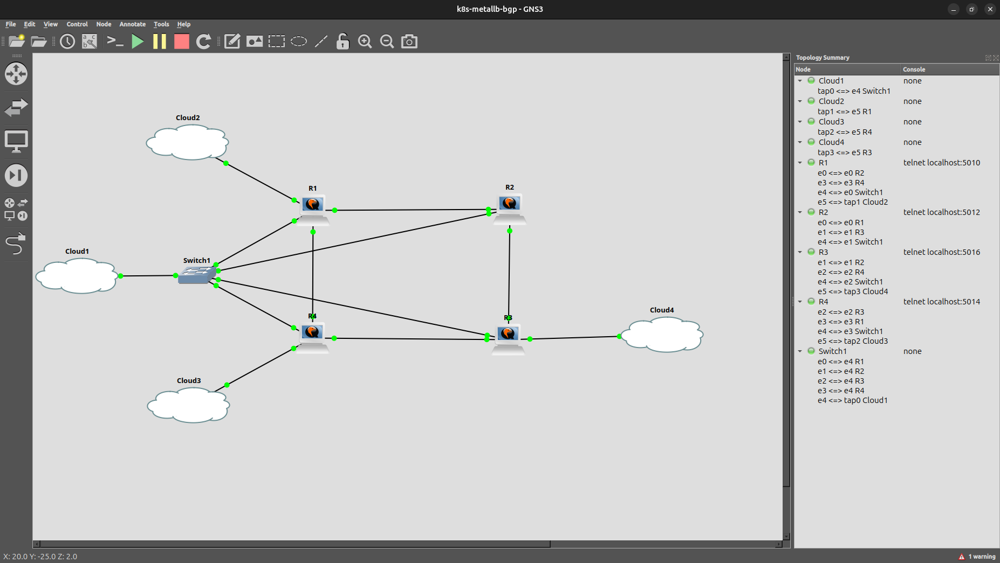
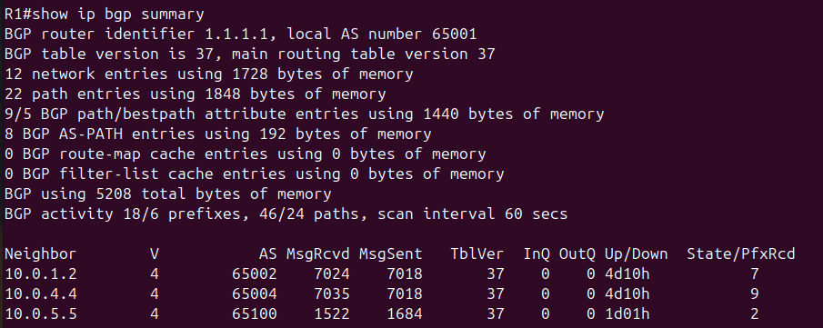
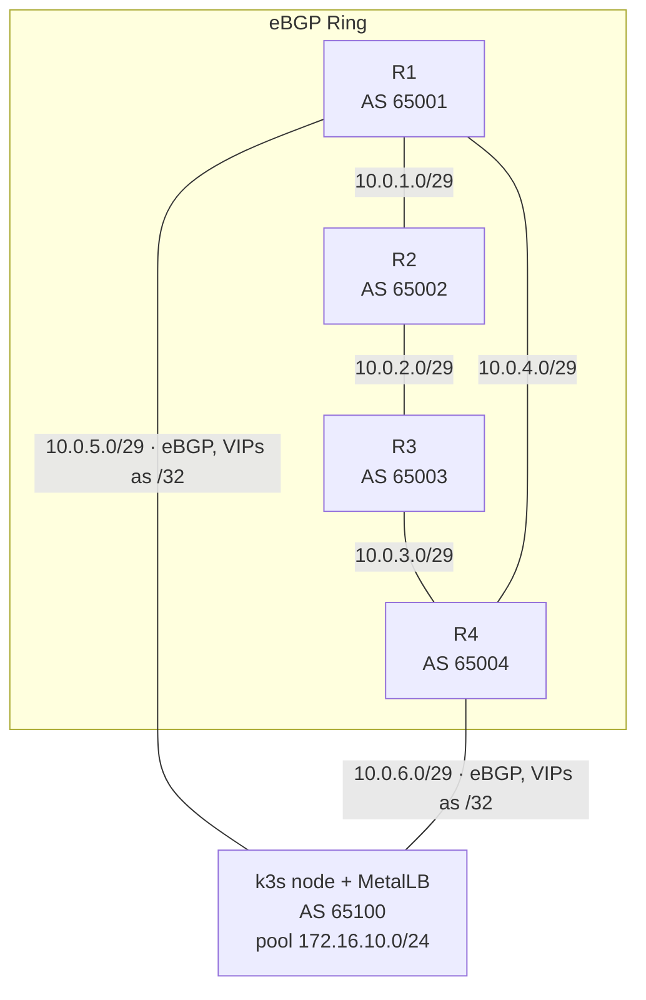
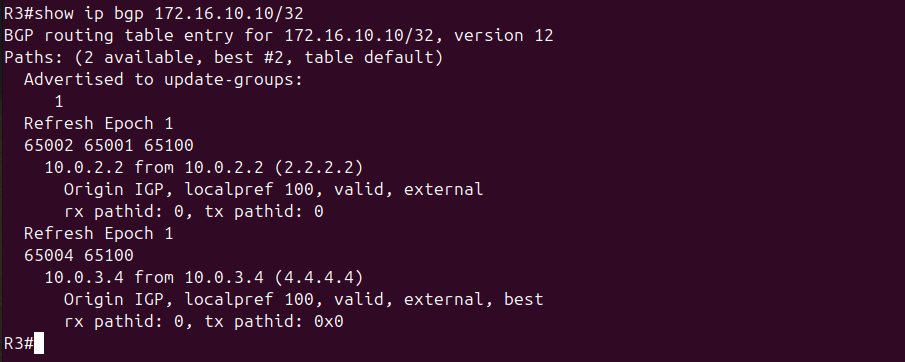
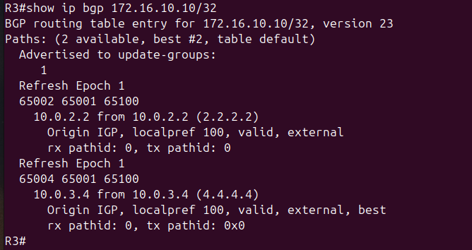

# Kubernetes MetalLB BGP Lab

A single-node k3s cluster advertises Kubernetes `LoadBalancer` services into a four-router eBGP ring using MetalLB in native BGP mode. The cluster runs as AS 65100 and peers with two routers (R1 and R4) over redundant uplinks. Each service is announced as a /32 host route and propagates across the ring through normal eBGP. Shutting down either uplink reroutes traffic over the surviving path with no change to the cluster — the failover happens entirely in the routing layer.

The lab is built two ways from the same addressing and BGP design: a full **GNS3 / Cisco IOSv** topology configured with Ansible, and a headless **containerlab / FRR** variant.



---

## Overview

This lab builds the routing layer underneath a bare-metal Kubernetes `LoadBalancer`. The surrounding routers treat the cluster as just another autonomous system. It demonstrates three things end to end: **service IP advertisement** (a Kubernetes service becoming a real route in a router's table), **eBGP path selection** (the ring picking the shorter AS path to the cluster), and **routed failover** (traffic surviving the loss of an uplink).

## Architecture

The four routers form an eBGP ring, each in its own AS (65001–65004). The k3s host attaches to R1 and R4 over two transit links and runs MetalLB as AS 65100. MetalLB opens one eBGP session to each of R1 and R4 and advertises every `LoadBalancer` service IP as a /32. R2 and R3 never peer with the cluster directly. They learn the service routes through standard eBGP propagation around the ring.

R1's session table shows all three neighbors up, with the MetalLB session (`10.0.5.5`, AS 65100) delivering the two service /32s:





**Data flow.** A client routed into the ring sends traffic toward a service VIP (e.g. `172.16.10.10/32`). Each router forwards along its BGP best path toward AS 65100. Inbound traffic enters the cluster through whichever edge router sits on the shortest AS path from its entry point: R1 for traffic arriving at R1 or R2, R4 for traffic arriving at R3 or R4. No routing policy prefers one uplink over the other for inbound traffic. On the node, kube-proxy DNATs the VIP to a backing pod. Return traffic follows static host routes that prefer the R1 uplink. That preference applies to replies only, and it covers host-side TAP loss rather than R1 failure, as noted in `scripts/setup-taps.sh`.

**Path selection.** R3 hears the cluster from both sides of the ring at unequal distances: two AS hops via R4 (`65004 65100`) and three the long way around (`65002 65001 65100`). It selects the shorter path via R4 as best.



**Failover.** Shutting R4's cluster-facing interface (GigabitEthernet0/5) tears down the direct MetalLB session and withdraws the routes R4 originated. R4 then learns the VIP from R1 around the ring and re-advertises it to R3 as `65004 65001 65100`. R3 now holds two three-hop paths: `65002 65001 65100` from R2, present in its table since before the failure, and the new `65004 65001 65100` from R4. With path lengths tied, the path-age tiebreaker keeps R3's best path on the R4 session: `65004 65001 65100`, next hop `10.0.3.4` unchanged. Traffic reaches the cluster through R4 and R1, entering via R1's uplink. Service traffic continues uninterrupted. Restoring the link re-establishes the MetalLB session, and R3's best path returns to `65004 65100`.



## Technologies Used

| Technology | Purpose |
|---|---|
| k3s | Lightweight single-node Kubernetes cluster |
| MetalLB (BGP mode) | Advertises `LoadBalancer` service IPs as BGP routes |
| Cisco IOSv | Router OS for the GNS3 topology |
| FRRouting 9.1.0 | Router OS for the headless containerlab variant |
| GNS3 | Network emulation for the IOSv topology |
| containerlab | Declarative, headless topology for the FRR variant |
| Ansible (`cisco.ios`) | Idempotent interface and BGP configuration + verification |
| Helm | Installs the MetalLB chart |
| Python 3 | Console bootstrap (GNS3 API) and BGP verification (`vtysh` JSON) |
| Bash | Staged, resumable deployment and host networking setup |
| Linux TAP / veth | Connects the host-run cluster to the emulated/containerized ring |

## Prerequisites

### GNS3 path

- GNS3 with the four-router IOSv topology built (see [`gns3/README.md`](gns3/README.md))
- Ansible with the `cisco.ios` collection
- Python 3
- `curl` and `helm` on the Linux GNS3 host

### containerlab path

- Docker and containerlab
- Python 3 (for `verify_bgp.py`)

## Project Structure

```text
k8s-metallb-bgp/
├── deploy-lab.sh            # one-command deploy with --from <stage> resume
├── deploy.yml               # pushes interface + BGP config to R1–R4
├── verify.yml               # ring-only BGP session + cross-ring ping checks
├── verify-k8s-routes.yml    # MetalLB session + service-route assertions
├── inventory.yml            # R1–R4 at 192.168.0.1–.4
├── ansible.cfg              # inventory path, paramiko ssh_type, host-key checking off
├── group_vars/routers.yml   # connection vars (network_cli, admin/admin; paramiko ssh_type in ansible.cfg)
├── host_vars/R1–R4.yml      # per-router AS, interfaces, BGP neighbors
├── templates/
│   ├── interfaces.j2        # hostname + interface addressing
│   └── bgp.j2               # router bgp, neighbors, address-family
├── k8s/
│   ├── metallb-config.yaml  # IPAddressPool, BGPAdvertisement, two BGPPeers
│   ├── whoami.yaml          # 2-replica echo service at 172.16.10.10
│   └── nginx-hello.yaml     # 1-replica nginx at 172.16.10.20
├── scripts/
│   ├── setup-taps.sh        # creates tap0/1/2 + return routes (GNS3)
│   ├── install-k3s.sh       # k3s + Helm + MetalLB chart
│   └── bootstrap-routers.py # console bootstrap via the GNS3 API
├── images/
│   ├── gns3-topology.png            # topology canvas
│   ├── show-ip-bgp-summary-r1.png   # R1 sessions incl. MetalLB peer
│   ├── show-ip-bgp-r3.png           # baseline best path via R4
│   └── show-ip-bgp-r3-after-shutdown.png  # failover best path
├── containerlab/            # headless FRR 9.1.0 variant (same addressing)
│   ├── metallb-ring.clab.yml
│   ├── daemons              # FRR daemon toggles
│   ├── r1..r4/frr.conf      # per-router FRR configs (mirror host_vars)
│   ├── setup-host-links.sh
│   └── verify_bgp.py        # vtysh JSON session + route checks
└── gns3/
    ├── README.md            # physical link map, neighbor + management tables
    └── k8s-metallb-bgp/     # importable GNS3 project (topology + project files)
```

## Addressing

| Segment | Subnet | Endpoints |
|---------|--------|-----------|
| R1 ↔ R2 | 10.0.1.0/29 | R1 Gi0/0 = .1, R2 Gi0/0 = .2 |
| R2 ↔ R3 | 10.0.2.0/29 | R2 Gi0/1 = .2, R3 Gi0/1 = .3 |
| R3 ↔ R4 | 10.0.3.0/29 | R3 Gi0/2 = .3, R4 Gi0/2 = .4 |
| R4 ↔ R1 | 10.0.4.0/29 | R4 Gi0/3 = .4, R1 Gi0/3 = .1 |
| R1 ↔ k3s | 10.0.5.0/29 | R1 Gi0/5 = .1, node tap1 = .5 |
| R4 ↔ k3s | 10.0.6.0/29 | R4 Gi0/5 = .4, node tap2 = .5 |
| Management | 192.168.0.0/24 | R1–R4 = .1–.4, host tap0 = .100 |
| MetalLB pool | 172.16.10.0/24 | whoami = .10, nginx-hello = .20 |

Full physical link and management tables are in [`gns3/README.md`](gns3/README.md).

## Deployment (GNS3)

Import the GNS3 project and start the nodes first, then run everything in order:

```bash
./deploy-lab.sh
```

Resume after a failure at any stage:

```bash
./deploy-lab.sh --from <stage>     # taps → bootstrap → routers → cluster → services → verify
```

Step by step:

```bash
./scripts/setup-taps.sh                                   # 1. host TAPs + return routes
python3 scripts/bootstrap-routers.py                      # 2. console-bootstrap SSH on R1–R4
ansible-playbook deploy.yml && ansible-playbook verify.yml # 3. configure + verify the ring
./scripts/install-k3s.sh                                  # 4. k3s + Helm + MetalLB
sudo k3s kubectl apply -f k8s/metallb-config.yaml         # 5. pool, advertisement, peers
sudo k3s kubectl apply -f k8s/whoami.yaml -f k8s/nginx-hello.yaml  # 6. demo services
ansible-playbook verify-k8s-routes.yml                    # 7. end-to-end route checks
```

A few implementation notes worth knowing before you run it:

- **TAPs are not persistent.** `setup-taps.sh` must be rerun after a host reboot, and you MUST bind `tap0`/`tap1`/`tap2` to their GNS3 Cloud nodes.
- **ServiceLB must be disabled.** `install-k3s.sh` installs k3s with `--disable servicelb --disable traefik`; otherwise k3s's built-in load balancer claims every `LoadBalancer` service before MetalLB can.
- **Sessions bind to the right interface.** Each `BGPPeer` sets `sourceAddress` explicitly so the MetalLB speaker originates its TCP session from the correct TAP.
- **Loose RPF is required.** Traffic can arrive on the backup uplink (tap2) while replies to ring sources leave via tap1. With strict rp_filter the kernel drops those arriving packets at the interface. Both setup-taps.sh and the containerlab setup-host-links.sh set rp_filter=2 on the transit interfaces automatically.

## Deployment (containerlab)

The FRR variant reuses the same addressing and the same `k8s/metallb-config.yaml`:

```bash
cd containerlab
sudo containerlab deploy -t metallb-ring.clab.yml
sudo ./setup-host-links.sh          # address k3s-r1/k3s-r4, return routes, rp_filter=2
# then install k3s, apply metallb-config.yaml, and deploy services (GNS3 steps 4–6)
python3 verify_bgp.py --ring-only   # ring sessions before the cluster is up
python3 verify_bgp.py               # full check after MetalLB is up
```

## Validation

**BGP sessions.** On R1, `show ip bgp summary` shows three neighbors: R2 (`10.0.1.2`), R4 (`10.0.4.4`), and the cluster (`10.0.5.5`, AS 65100). The MetalLB peer's `PfxRcd` equals the number of advertised services (2 with both demos deployed).


**Path selection.**  On R3, the cluster is visible from both directions at unequal distance: two AS hops via R4, three via R2 - R1. The shorter AS path wins:

```bash
show ip bgp 172.16.10.10/32   # two paths: 65002 65001 65100 and 65004 65100; shorter via R4 is best
```


**Service reachability.** VIPs do not answer ICMP. The /32 exists in the routers' tables, but on the node it is only a kube-proxy DNAT rule, not an interface address. Test over TCP:

```bash
curl http://172.16.10.10   # alternates between pod hostnames across repeated requests
curl http://172.16.10.20
```

To watch continuity through a failover test, run a monitoring loop that prints the responding pod hostname each second (it also demonstrates the pod alternation claim above):

```bash
while :; do
  printf '%s  %s\n' "$(date +%T)" \
    "$(curl -sf --max-time 2 http://172.16.10.10 | awk '/Hostname/{print $2}')" \
    || printf '%s  FAIL\n' "$(date +%T)"
  sleep 1
done
```

**Failover.** With the curl loop running, shut R4's cluster-facing interface:

```text
R4(config)# interface GigabitEthernet0/5
R4(config-if)# shutdown          # R4 re-advertises via R1: R3 sees 65004 65001 65100, best path unchanged (oldest external); curl keeps responding
R4(config-if)# no shutdown       # MetalLB session re-establishes (~30-60s); R3 best path returns to 65004 65100
```

BGP fast external fallover tears down the MetalLB session the instant the interface flaps, and R4 switches locally to the path it already holds from R1. R3 sees the updated `65004 65001 65100` path within the eBGP advertisement interval (30 seconds worst case, usually single digits).


Note that R3 alone cannot detect a failed R4 uplink due to the tiebreaker leaving its best path and next hop unchanged. Convergence is observable on R4, where `show ip bgp 172.16.10.10/32` shows the route source flip from the direct AS 65100 session to the R1 ring session, and on R2, where the two-hop path via R1 stays best throughout. This is also why `verify-k8s-routes.yml` asserts both MetalLB sessions Established directly rather than inferring health from downstream route state.

The Ansible playbooks and `verify_bgp.py` automate the session-state and route-origination checks so validation does not depend on reading CLI output by hand.

## Future Improvements

- **CI for the containerlab variant** — wire `verify_bgp.py` into GitHub Actions so the FRR path is tested on every push (the headless design already supports it).
- **Observability** — scrape the MetalLB speaker and FRR/IOSv with Prometheus and add a Grafana view of session state and advertised prefixes.
- **Idempotent teardown** — a `destroy` stage that removes TAPs, routes, and the k3s install cleanly.
- **Secrets hygiene** — replace the `admin`/`admin` lab credentials and world-readable kubeconfig with something closer to production practice (documented as a deliberate lab shortcut today).

## Screenshots

Remaining captures that would strengthen the README:

1. **`kubectl get svc` + MetalLB speaker logs** — the two services with their external IPs and the speaker announcing the /32s. Place under Deployment.
2. **R4 during failover** — `show ip bgp 172.16.10.10/32` showing the route source flipped from the direct AS 65100 session to the R1 ring session, the router where convergence is actually visible.
3. **Curl loop during failover** — timestamped responses straight through the shut/no shut cycle, proving zero-drop failover.

---

## containerlab vs. GNS3

`containerlab/` is a headless FRR 9.1.0 counterpart with identical addressing and BGP design. The two cluster uplinks surface as host veth interfaces (`k3s-r1`, `k3s-r4`) instead of TAPs, so the same `k8s/metallb-config.yaml` is reused unchanged. `verify_bgp.py` reads `vtysh` JSON (`show bgp ipv4 unicast summary json`) inside each container to assert session state and route origination; `--ring-only` mirrors what `verify.yml` checks before the cluster is up. This path needs no GUI and is the one to target for CI.
