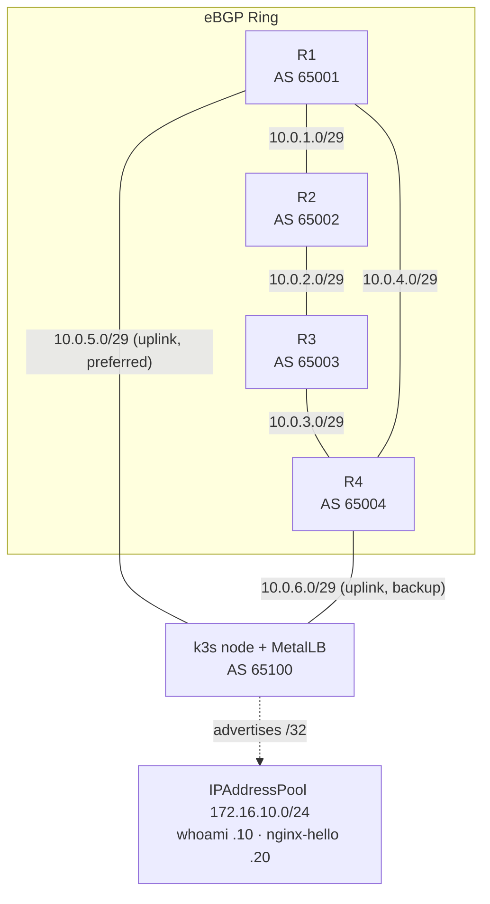

# Kubernetes MetalLB BGP Lab

A single-node k3s cluster advertises Kubernetes `LoadBalancer` services into a four-router eBGP ring using MetalLB in native BGP mode. The cluster runs as AS 65100 and peers with two routers (R1 and R4) over redundant uplinks. Each service is announced as a /32 host route and propagates across the ring through normal eBGP. Shutting down either uplink reroutes traffic over the surviving path with no change to the cluster — the failover happens entirely in the routing layer.

The lab is built two ways from the same addressing and BGP design: a full **GNS3 / Cisco IOSv** topology configured with Ansible, and a headless **containerlab / FRR** variant that runs without a GUI and is suitable for CI.

---

## Overview

This lab builds the routing layer underneath a bare-metal Kubernetes `LoadBalancer`: how a cluster gets a routable service IP and how that IP behaves under link failure. MetalLB originates a BGP route for each service; the surrounding routers treat the cluster as just another autonomous system. It demonstrates three things end to end and reproducibly: **service IP advertisement** (a Kubernetes service becoming a real route in a router's table), **eBGP path selection** (the ring picking the shorter AS path to the cluster), and **routed failover** (traffic surviving the loss of an uplink without touching Kubernetes).

## Skills Demonstrated

- **Networking / BGP** — multi-AS eBGP design, AS-path selection, /32 host-route advertisement, redundant peering, convergence and failover testing.
- **Kubernetes** — single-node k3s, `LoadBalancer` service type, MetalLB in BGP mode, Helm-based component install, kube-proxy DNAT behavior.
- **Infrastructure as Code** — idempotent router configuration with Ansible (templated interfaces and BGP), declarative MetalLB config, declarative containerlab topology.
- **Automation / Python** — console bootstrap over raw TCP against the GNS3 API; programmatic BGP verification via `vtysh` JSON.
- **Linux networking** — TAP/veth interfaces, policy routing with metrics, reverse-path filtering (`rp_filter`), IP forwarding.
- **Bash** — staged, resumable deployment orchestration.
- **Verification as code** — Ansible assertions and a Python checker that validate session state and route origination rather than relying on manual inspection.

## Architecture

The four routers form an eBGP ring, each in its own AS (65001–65004). The k3s host attaches to R1 and R4 over two transit links and runs MetalLB as AS 65100. MetalLB opens one eBGP session to each of R1 and R4 and advertises every `LoadBalancer` service IP as a /32. R2 and R3 never peer with the cluster directly — they learn the service routes through standard eBGP propagation around the ring, which is what makes the path-selection and failover behavior observable from the far side.



**Data flow.** A client routed into the ring sends traffic toward a service VIP (e.g. `172.16.10.10/32`). Each router forwards along its BGP best path toward AS 65100. The packet reaches the k3s node over R1 (preferred) or R4 (backup), where kube-proxy DNATs the VIP to a backing pod. Return traffic follows host routes installed on the node, which prefer the R1 uplink (lower metric).

**Path selection.** R3 sits two AS hops from the cluster in either direction. Its BGP table holds two paths for each service route — `65002 65001 65100` via R1 and `65004 65100` via R4 — and it selects the shorter one (via R4) as best.

**Failover.** Shutting R4's cluster-facing interface withdraws the R4 session. R3's best path shifts to `65002 65001 65100` via R1, and service traffic continues uninterrupted. Restoring the link flips the best path back.

**Reverse-path filtering.** The node receives traffic on both uplinks but always prefers `tap1`/`k3s-r1` for replies. With strict `rp_filter`, replies to packets that arrived on the backup interface would be dropped, so the lab sets loose RPF (`rp_filter=2`) on both interfaces.

## Technologies Used

| Technology | Purpose |
|---|---|
| k3s | Lightweight single-node Kubernetes cluster |
| MetalLB (BGP mode) | Advertises `LoadBalancer` service IPs as BGP routes |
| Cisco IOSv | Router OS for the GNS3 topology |
| FRRouting 9.1.0 | Router OS for the headless containerlab variant |
| GNS3 | Network emulation for the IOSv topology |
| containerlab | Declarative, headless topology for the FRR variant |
| Ansible (`cisco.ios`) | Idempotent interface and BGP configuration + verification |
| Helm | Installs the MetalLB chart |
| Python 3 | Console bootstrap (GNS3 API) and BGP verification (`vtysh` JSON) |
| Bash | Staged, resumable deployment and host networking setup |
| Linux TAP / veth | Connects the host-run cluster to the emulated/containerized ring |

## Prerequisites

### GNS3 path

- GNS3 with the four-router IOSv topology built (see [`gns3/README.md`](gns3/README.md))
- Ansible with the `cisco.ios` collection
- Python 3
- `curl`, `sudo`, and `helm` on the Linux GNS3 host

### containerlab path

- Docker and containerlab
- Python 3 (for `verify_bgp.py`)
- The same `curl`/`sudo` tooling to install k3s and MetalLB

## Project Structure

```text
k8s-metallb-bgp/
├── deploy-lab.sh            # one-command deploy with --from <stage> resume
├── deploy.yml               # pushes interface + BGP config to R1–R4
├── verify.yml               # ring-only BGP session + cross-ring ping checks
├── verify-k8s-routes.yml    # MetalLB session + service-route assertions
├── inventory.yml            # R1–R4 at 192.168.0.1–.4
├── group_vars/routers.yml   # connection vars (paramiko, admin/admin)
├── host_vars/R1–R4.yml      # per-router AS, interfaces, BGP neighbors
├── templates/
│   ├── interfaces.j2        # hostname + interface addressing
│   └── bgp.j2               # router bgp, neighbors, address-family
├── k8s/
│   ├── metallb-config.yaml  # IPAddressPool, BGPAdvertisement, two BGPPeers
│   ├── whoami.yaml          # 2-replica echo service at 172.16.10.10
│   └── nginx-hello.yaml     # 1-replica nginx at 172.16.10.20
├── scripts/
│   ├── setup-taps.sh        # creates tap0/1/2 + return routes (GNS3)
│   ├── install-k3s.sh       # k3s + Helm + MetalLB chart
│   └── bootstrap-routers.py # console bootstrap via the GNS3 API
├── containerlab/            # headless FRR 9.1.0 variant (same addressing)
│   ├── metallb-ring.clab.yml
│   ├── setup-host-links.sh
│   └── verify_bgp.py        # vtysh JSON session + route checks
└── gns3/README.md           # physical link map, neighbor + management tables
```

## Addressing

| Segment | Subnet | Endpoints |
|---------|--------|-----------|
| R1 ↔ R2 | 10.0.1.0/29 | R1 Gi0/0 = .1, R2 Gi0/0 = .2 |
| R2 ↔ R3 | 10.0.2.0/29 | R2 Gi0/1 = .2, R3 Gi0/1 = .3 |
| R3 ↔ R4 | 10.0.3.0/29 | R3 Gi0/2 = .3, R4 Gi0/2 = .4 |
| R4 ↔ R1 | 10.0.4.0/29 | R4 Gi0/3 = .4, R1 Gi0/3 = .1 |
| R1 ↔ k3s | 10.0.5.0/29 | R1 Gi0/5 = .1, node tap1 = .5 |
| R4 ↔ k3s | 10.0.6.0/29 | R4 Gi0/5 = .4, node tap2 = .5 |
| Management | 192.168.0.0/24 | R1–R4 = .1–.4, host tap0 = .100 |
| MetalLB pool | 172.16.10.0/24 | whoami = .10, nginx-hello = .20 |

Full physical link and management tables are in [`gns3/README.md`](gns3/README.md).

## Deployment (GNS3)

Import the GNS3 project and start the nodes first, then run everything in order:

```bash
./deploy-lab.sh
```

Resume after a failure at any stage:

```bash
./deploy-lab.sh --from <stage>     # taps → bootstrap → routers → cluster → services → verify
```

Step by step, if you prefer:

```bash
./scripts/setup-taps.sh                                   # 1. host TAPs + return routes
python3 scripts/bootstrap-routers.py                      # 2. console-bootstrap SSH on R1–R4
ansible-playbook deploy.yml && ansible-playbook verify.yml # 3. configure + verify the ring
./scripts/install-k3s.sh                                  # 4. k3s + Helm + MetalLB
sudo k3s kubectl apply -f k8s/metallb-config.yaml         # 5. pool, advertisement, peers
sudo k3s kubectl apply -f k8s/whoami.yaml -f k8s/nginx-hello.yaml  # 6. demo services
ansible-playbook verify-k8s-routes.yml                    # 7. end-to-end route checks
```

A few implementation notes worth knowing before you run it:

- **TAPs are not persistent.** `setup-taps.sh` must be rerun after a host reboot, and you must bind `tap0`/`tap1`/`tap2` to their GNS3 Cloud nodes before continuing.
- **ServiceLB must be disabled.** `install-k3s.sh` installs k3s with `--disable servicelb --disable traefik`; otherwise k3s's built-in load balancer claims every `LoadBalancer` service before MetalLB can.
- **Sessions bind to the right interface.** Each `BGPPeer` sets `sourceAddress` explicitly so the MetalLB speaker originates its TCP session from the correct TAP.
- **Loose RPF is required** on the cluster uplinks (`rp_filter=2`) so replies to traffic that arrived on the backup interface are not dropped.

## Deployment (containerlab)

The FRR variant reuses the same addressing and the same `k8s/metallb-config.yaml`:

```bash
cd containerlab
sudo containerlab deploy -t metallb-ring.clab.yml
sudo ./setup-host-links.sh          # address k3s-r1/k3s-r4, return routes, rp_filter=2
# then install k3s, apply metallb-config.yaml, and deploy services (GNS3 steps 4–6)
python3 verify_bgp.py --ring-only   # ring sessions before the cluster is up
python3 verify_bgp.py               # full check after MetalLB is up
```

## Validation

**BGP sessions.** On R1, `show ip bgp summary` shows three neighbors: R2 (`10.0.1.2`), R4 (`10.0.4.4`), and the cluster (`10.0.5.5`, AS 65100). The MetalLB peer's `PfxRcd` equals the number of advertised services (2 with both demos deployed).

**Path selection.** On R3, two AS hops from the cluster either way:

```bash
show ip bgp 172.16.10.10/32   # two paths: 65002 65001 65100 and 65004 65100; shorter via R4 is best
```

**Service reachability.** VIPs do not answer ICMP — the /32 exists in the routers' tables, but on the node it is only a kube-proxy DNAT rule, not an interface address. Test over TCP:

```bash
curl http://172.16.10.10   # alternates between pod hostnames across repeated requests
curl http://172.16.10.20
```

**Failover.** Shut R4's cluster-facing interface and watch the path move without dropping the service:

```text
R4(config)# interface GigabitEthernet0/5
R4(config-if)# shutdown          # R3 best path → 65002 65001 65100 via R1; curl keeps responding
R4(config-if)# no shutdown       # path flips back to R4
```

The Ansible playbooks and `verify_bgp.py` automate the session-state and route-origination checks so validation does not depend on reading CLI output by hand.

## Lessons Learned

- **MetalLB is a BGP speaker, not magic.** A `LoadBalancer` IP on bare metal is only reachable because a real BGP session advertises it; treating MetalLB as just another AS makes the integration with an existing network straightforward to reason about.
- **The data path and the control path can disagree.** Routers learn the /32 and forward toward it, but the VIP is a DNAT rule on the node, not an addressable interface — which is why it answers TCP but not ICMP.
- **Redundancy lives in the routing layer.** Failover here is pure eBGP withdrawal and reconvergence; Kubernetes is unaware a link went down.
- **Host networking is half the lab.** Reverse-path filtering, return-route metrics, and per-session `sourceAddress` binding are the difference between a working asymmetric path and silent drops.
- **k3s startup is racy.** The systemd unit returns before the API server is serving; polling for the node object before `kubectl wait` avoids a "no matching resources" failure.

## Future Improvements

- **CI for the containerlab variant** — wire `verify_bgp.py` into GitHub Actions so the FRR path is tested on every push (the headless design already supports it).
- **BFD** on the MetalLB peerings for sub-second failover instead of relying on BGP hold timers.
- **Observability** — scrape the MetalLB speaker and FRR/IOSv with Prometheus and add a Grafana view of session state and advertised prefixes.
- **L2 mode comparison** — a parallel MetalLB L2 configuration to contrast ARP-based failover with BGP.
- **Idempotent teardown** — a `destroy` stage that removes TAPs, routes, and the k3s install cleanly.
- **Secrets hygiene** — replace the `admin`/`admin` lab credentials and world-readable kubeconfig with something closer to production practice (documented as a deliberate lab shortcut today).

## Screenshots

The repository currently ships no images. The following would make the README far more compelling to a reviewer skimming on GitHub, and would prove the lab actually runs:

1. **GNS3 topology canvas** — the four routers, switch, and three Cloud nodes wired up. Insert near the top, under the title.
2. **`show ip bgp summary` on R1** — three neighbors Established, including AS 65100 with a non-zero `PfxRcd`. Place in Validation.
3. **`show ip bgp 172.16.10.10/32` on R3** — the two AS paths with the shorter one marked best. Place in Validation under "Path selection."
4. **Failover side-by-side** — R3's best path before and after shutting R4's uplink, with a `curl` loop still responding. Place in Validation under "Failover."
5. **`kubectl get svc` + MetalLB speaker logs** — the two services with their external IPs and the speaker announcing the /32s. Place under Deployment.

A short terminal recording (asciinema/GIF) of the failover would be the single highest-impact addition.

---

## containerlab vs. GNS3

`containerlab/` is a headless FRR 9.1.0 counterpart with identical addressing and BGP design. The two cluster uplinks surface as host veth interfaces (`k3s-r1`, `k3s-r4`) instead of TAPs, so the same `k8s/metallb-config.yaml` is reused unchanged. `verify_bgp.py` reads `vtysh` JSON (`show bgp ipv4 unicast summary json`) inside each container to assert session state and route origination; `--ring-only` mirrors what `verify.yml` checks before the cluster is up. This path needs no GUI and is the one to target for CI.
