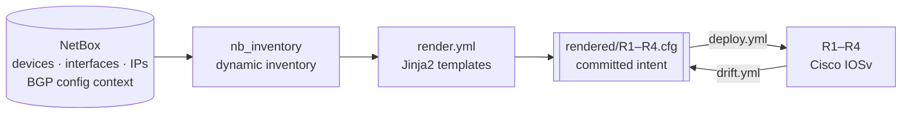
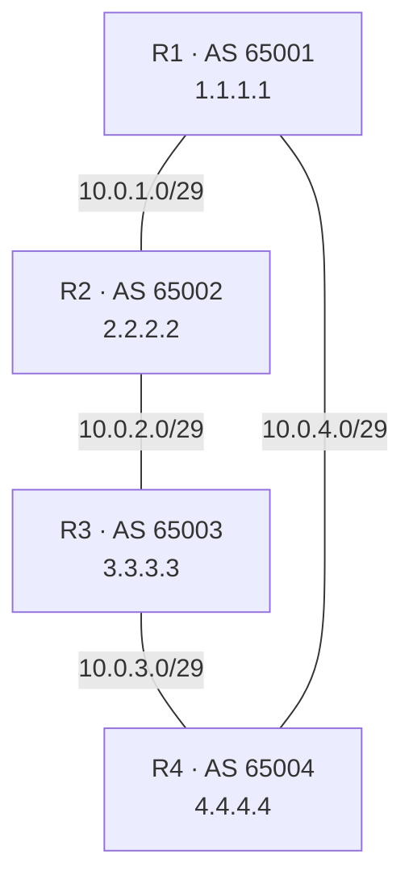

# NetBox Source of Truth Lab

The same four-router eBGP ring as [ansible-bgp](../ansible-bgp) and [k8s-metallb-bgp](../k8s-metallb-bgp), with one thing changed: the per-router data now lives in NetBox. Ansible pulls inventory and variables from the NetBox API, renders them into committed intended configs, pushes those to the routers, and a drift playbook reports when a router stops matching what NetBox says it should be.



## The operating model change

Every other Ansible lab in this repo works the same way: a static `inventory.yml` lists the routers, `host_vars/R1.yml` through `R4.yml` hold each router's AS number, addressing, and BGP neighbours, and a template turns those into config.

| | Other labs | This lab |
| --- | --- | --- |
| Host list | `inventory.yml`, hand-written | `nb_inventory` querying NetBox |
| Per-router data | `host_vars/R1.yml` … | NetBox devices, interfaces, IP addresses, config contexts |
| `ansible_host` | hard-coded in inventory | NetBox `primary_ip4` |
| To change an IP | edit YAML, commit | edit NetBox, export, render, commit |
| Committed artifact | the input (`host_vars/`) | the output (`rendered/`) |

## What NetBox models, and what it does not

**In NetBox:** one site, four devices (type IOSv, platform `ios`, role `router`), their interfaces, the IP addresses assigned to those interfaces, management IPs marked primary, and a per-device config context carrying local AS, router ID, BGP neighbours, and advertised networks.

## Topology



Addressing and AS layout are carried over unchanged from `k8s-metallb-bgp` minus the k3s transit links, so the two builds are directly comparable.

| Device | AS | Router ID | Ring interfaces | Management |
| --- | --- | --- | --- | --- |
| R1 | 65001 | 1.1.1.1 | Gi0/0 `10.0.1.1/29` → R2, Gi0/3 `10.0.4.1/29` → R4 | Gi0/4 `192.168.0.1/24` |
| R2 | 65002 | 2.2.2.2 | Gi0/0 `10.0.1.2/29` → R1, Gi0/1 `10.0.2.2/29` → R3 | Gi0/4 `192.168.0.2/24` |
| R3 | 65003 | 3.3.3.3 | Gi0/1 `10.0.2.3/29` → R2, Gi0/2 `10.0.3.3/29` → R4 | Gi0/4 `192.168.0.3/24` |
| R4 | 65004 | 4.4.4.4 | Gi0/2 `10.0.3.4/29` → R3, Gi0/3 `10.0.4.4/29` → R1 | Gi0/4 `192.168.0.4/24` |

Each router advertises its own loopback /32 and its two ring /29s. The management network is not advertised, and it is not rendered or deployed either.

## Technologies Used

| Technology | Purpose |
| --- | --- |
| NetBox 4.6 | Source of truth for devices, interfaces, IPAM, and BGP config contexts |
| Docker Compose | Runs the NetBox stack (NetBox, worker, PostgreSQL, two Valkey instances) |
| `netbox.netbox.nb_inventory` | Dynamic inventory: hosts, `ansible_host`, interfaces, config contexts |
| pynetbox | Population and export scripts against the NetBox REST API |
| Ansible (`cisco.ios`) | Render, deploy, verify, and drift-check |
| Jinja2 | Templates shared by the render and drift paths |
| `ansible.utils.ipaddr` | Converts NetBox CIDR notation into the subnet masks IOS wants |
| Cisco IOSv (GNS3) | The four routers |

## Prerequisites

- A host running Docker and Docker Compose for the NetBox stack.
- GNS3 with the four-router IOSv topology built and reachable on `192.168.0.0/24`. [`scripts/setup-taps.sh`](scripts/setup-taps.sh) creates the tap interface that segment binds to.
- A control node that can reach both the NetBox API and the routers' management network.
- Python 3 and Ansible with the collections in [`requirements.yml`](requirements.yml):

```bash
ansible-galaxy collection install -r requirements.yml
pip install -r requirements.txt
```

## Project Structure

```text
netbox-source-of-truth/
├── docker-compose.yml         # NetBox stack, versions pinned
├── .env.example               # NetBox secrets; API token provisioned after boot
├── ansible.cfg                # points at the live NetBox inventory
├── render.yml                 # NetBox data -> rendered/*.cfg, touches no device
├── deploy.yml                 # pushes rendered/*.cfg to the routers
├── verify.yml                 # per-neighbour Established + loopback reachability
├── drift.yml                  # running-config vs rendered intent, per section
├── inventory/
│   ├── netbox.yml             # nb_inventory config, the live source
│   └── netbox-export.yml      # GENERATED committed snapshot, CI renders from this
├── group_vars/routers.yml     # credentials and drift tuning; no per-router data
├── scripts/
│   ├── topology.py            # one-time seed, not the source of truth
│   ├── populate-netbox.py     # seed -> NetBox, bootstrap not reconciler
│   ├── export-netbox.py       # NetBox -> inventory/netbox-export.yml
│   └── setup-taps.sh          # tap0 on the GNS3 host for the mgmt segment
├── templates/
│   ├── device.cfg.j2          # wrapper, includes the two below
│   ├── interfaces.j2          # hostname + interface addressing
│   ├── bgp.j2                 # router bgp, neighbours, address-family
│   └── drift-report.json.j2   # section comparison logic
├── rendered/R1–R4.cfg         # GENERATED committed intent, deployed as-is
└── configs/                   # captured device configs for reference
```

## Build

### 1. Bring up NetBox

```bash
cp .env.example .env
```

Fill in every `replace-me` in `.env` with the exception of `NETBOX_TOKEN`. The generator commands are in the comments there. NetBox issues it after the stack is running, and step 2 collects it.

```bash
docker compose up -d
```

First boot runs migrations against an empty database and takes a couple of minutes. Wait for the `netbox` container to report healthy before continuing:

```bash
docker compose ps
```

### 2. Provision the API token

```bash
curl -s -X POST http://localhost:8000/api/users/tokens/provision/ \
  -H "Content-Type: application/json" \
  -d '{"username":"admin","password":"admin"}' \
  | python3 -m json.tool
```

The response returns `key` and `token` as separate fields. Join them as `nbt_<key>.<token>` and put that value in `.env` as `NETBOX_TOKEN`.

Every step from here reads `NETBOX_TOKEN` and `NETBOX_API` from the environment, and `.env` is the only place either one is written down. Load it:

```bash
set -a; source .env; set +a
```

`set -a` exports each assignment as the file is read, so the values reach `ansible-playbook` and `scripts/*.py` instead of staying in your shell. Run this again in any new terminal.

Confirm the token before going further:

```bash
curl -s -o /dev/null -w '%{http_code}\n' \
  -H "Authorization: Bearer $NETBOX_TOKEN" \
  "$NETBOX_API/api/dcim/sites/"
```

`200` means the token works.

### 3. Start the Python venv

```bash
python3 -m venv .venv
source .venv/bin/activate
pip install -r requirements.txt
ansible-galaxy collection install -r requirements.yml
```

### 3. Populate the ring

```bash
python3 scripts/populate-netbox.py
```

### 4. Check the dynamic inventory

```bash
ansible-inventory --graph
```

You should see `R1`–`R4` in a `routers` group.

### 5. Render

```bash
python3 scripts/export-netbox.py
ansible-playbook render.yml
```

### 6. Deploy and verify

```bash
ansible-playbook deploy.yml
ansible-playbook verify.yml
```

### 7. Check for drift

```bash
ansible-playbook drift.yml
```

## Drift walkthrough

Change something by hand on R2:

```text
R2(config)# interface GigabitEthernet0/1
R2(config-if)# router bgp 65002
R2(config-router)# neighbor 10.0.1.1 timers 5 15
```

Then run `ansible-playbook drift.yml`. R1, R3, and R4 pass. R2 fails, naming both sections:

```text
TASK [Show each drifted section] *****************************************************************************************************************************************************************************************************
skipping: [R1]
skipping: [R3]
skipping: [R4]
ok: [R2] => (item=router bgp 65002) => {
    "msg": [
        "section: router bgp 65002",
        "missing from device: []",
        "unexpected on device: ['neighbor 10.0.1.1 timers 5 15']"
    ]
}

```

As you can see, the drift was not corrected. The templates only add configuration.
